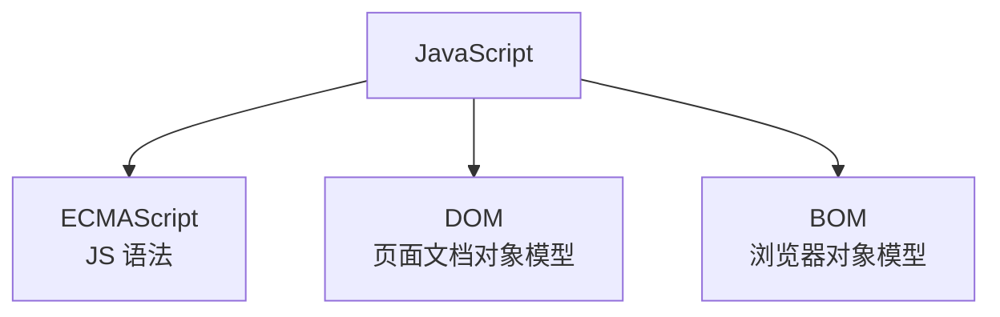
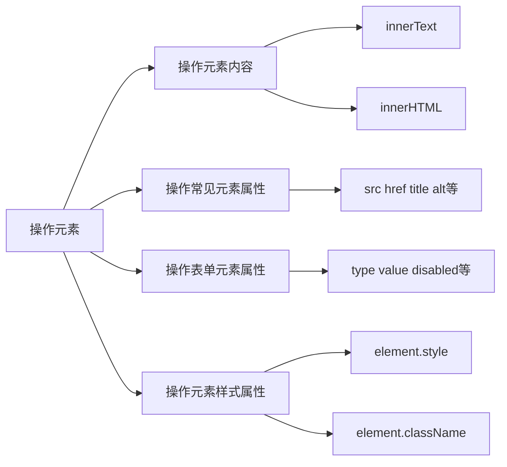
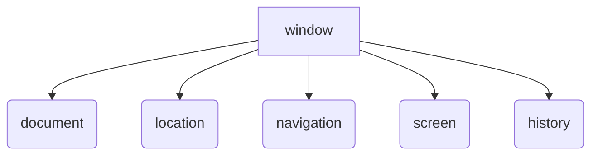
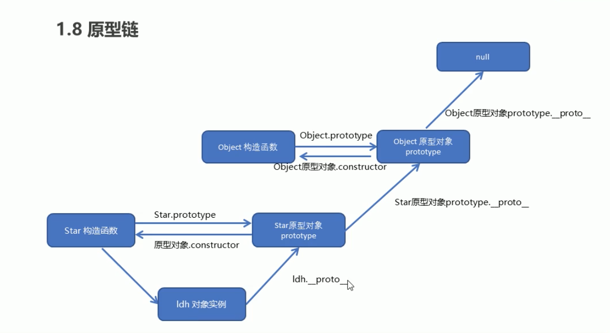
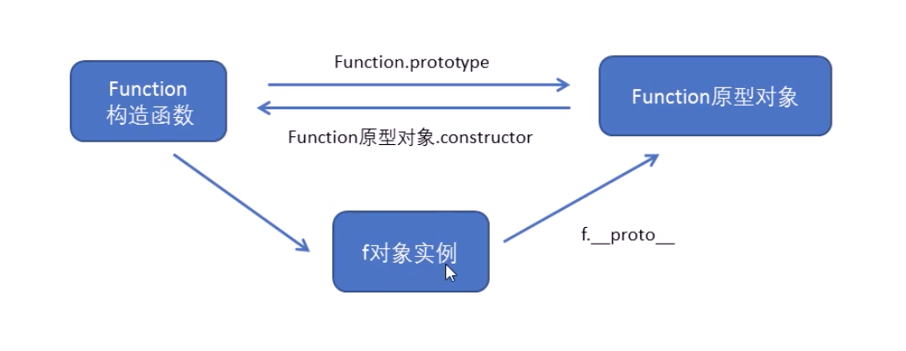

#  基础知识

##  初识** **JavaScript**

### **HTML/CSS/JS** **的关系**

**HTML/CSS** **标记语言** --  **描述类语言**

- - HTML 决定网页结构和内容( 决定看到什么 )，相当于人的身体
  - CSS 决定网页呈现给用户的模样( 决定好不好看 )，相当于给人穿衣服、化妆
  - 


**JS** **脚本语言 ** **--** **编程类语言** 

- - 实现业务逻辑和页面控制( 决定功能 )，相当于人的各种动作 

- 

### **浏览器执行** **JS** **简介**


浏览器分成两部分：渲染引擎和 JS 引擎

-  **渲染引擎**：用来解析HTML与CSS，俗称内核，比如 chrome 浏览器的 blink ，老版本的 webkit
-  **JS** **引擎**：也称为 JS 解释器。 用来读取网页中的JavaScript代码，对其处理后运行，比如 chrome  浏览器的 V8


浏览器本身并不会执行JS代码，而是通过内置 JavaScript 引擎(解释器) 来执行 JS 代码 。JS 引擎执行代码时逐行解释每一句源码（转换为机器语言），然后由计算机去执行，所以 JavaScript 语言归为脚本语言，会逐行解释执行。

### js 的组成



1. **ECMAScript**

   **ECMAScript** 是由ECMA 国际（ 原欧洲计算机制造商协会）进行标准化的一门编程语言，这种语言在万维网上应用广泛，它往往被称为 JavaScript 或 JScript，但实际上后两者是 ECMAScript 语言的实现和扩展。

2. DOM -- 文档对象模型

   **文档对象模型**（Document Object Model，简称DOM），是W3C组织推荐的处理可扩展标记语言的标准编程接口。通过 DOM 提供的接口可以对页面上的各种元素进行操作（大小、位置、颜色等）。

3. BOM  --- 浏览器对象模型

   **BOM** (Browser Object Model，简称BOM) 是指浏览器对象模型，它提供了独立于内容的、可以与浏览器窗口进行互动的对象结构。通过BOM可以操作浏览器窗口，比如弹出框、控制浏览器跳转、获取分辨率等。


### JS 的书写位置

1. 行内式

   ```js
   <input type="button" value="点我试试" onclick="alert('Hello World')" />
   ```

   - 可以将单行或少量 JS 代码写在HTML标签的事件属性中（以 on 开头的属性），如：onclick
   - 注意单双引号的使用：在HTML中我们推荐使用双引号, JS 中我们推荐使用单引号
   - 可读性差， 在html中编写JS大量代码时，不方便阅读；
   - 引号易错，引号多层嵌套匹配时，非常容易弄混；
   - 特殊情况下使用

2. 内嵌式

   ```js
    <script>
       alert('Hello  World~!');
    </script>
   ```

   - 可以将多行JS代码写到 <script> 标签中
   - 内嵌 JS 是学习时常用的方式

3. 外部文件

   ```js
   <script src="my.js"></script>
   ```

   - 利于HTML页面代码结构化，把大段 JS代码独立到 HTML 页面之外，既美观，也方便文件级别的复用
   - 引用外部 JS文件的 script 标签中间不可以写代码
   - 适合于JS 代码量比较大的情况

### JS 的注释

1. 单行注释 // 
2.  多行注释   /**/

### JS 的输入输出语句

| 方法             | 说明                           | 归属   |
| ---------------- | ------------------------------ | ------ |
| alert(msg)       | 浏览器弹出警示框               | 浏览器 |
| console.log(msg) | 浏览器控制台打印输出信息       | 浏览器 |
| prompt(into)     | 浏览器弹出输入框，用户可以输入 | 浏览器 |

> **注意：**alert() 主要用来显示消息给用户，console.log() 用来给程序员自己看运行时的消息。


## 变量

### 什么是变量

白话：变量就是一个装东西的盒子。

通俗：变量是用于存放数据的容器。 我们通过 变量名 获取数据，甚至数据可以修改。

### 变量的使用

变量的使用分为两步：1. 声明变量 2.赋值

1. 声明变量

   ```js
   var age;// 声明一个名称为 age 的变量
   ```

   - var 是一个 JS关键字，用来声明变量( variable 变量的意思 )。使用该关键字声明变量后，计算机会自动为变量分配内存空间，不需要程序员管
   - age 是程序员定义的变量名，我们要通过变量名来访问内存中分配的空间

2. 赋值

   ```js
   age =10;// 给age 这个变量赋值为10
   ```

   - = 用来把右边的值赋给左边的变量空间中   此处代表赋值的意思
   - 变量值是程序员保存到变量空间里的值

3. 变量的初始化

   ```js
   var age = 10; // 声明变量同时赋值为10
   ```

   声明一个变量并赋值，我们称之为变量的初始化。


### 更新变量

一个变量被重新复赋值后，它原有的值就会被覆盖，变量值将以最后一次赋的值为准。


```js
var age = 18;

age = 81;   // 最后的结果就是81因为18 被覆盖掉了       
```


### **变量命名规范**

- 由字母(A-Za-z)、数字(0-9)、下划线(_)、美元符号( $ )组成，如：usrAge, num01, _name
- 严格区分大小写。var app; 和 var App; 是两个变量
- 不能 以数字开头。  18age   是错误的
- 不能 是关键字、保留字。例如：var、for、while
- 变量名必须有意义。 MMD   BBD        nl   →     age  
- 遵守驼峰命名法。首字母小写，后面单词的首字母需要大写。 myFirstName
- 推荐翻译网站： 有道    爱词霸


## 数据类型


### 数据类型的简介

1. 为什么需要数据类型

在计算机中，不同的数据所需占用的存储空间是不同的，为了便于把数据分成所需内存大小不同的数据，充分利用存储空间，于是定义了不同的数据类型。

简单来说，数据类型就是数据的类别型号。比如姓名“张三”，年龄18，这些数据的类型是不一样的。


2. 变量的数据类型


变量是用来存储值的所在处，它们有名字和数据类型。变量的数据类型决定了如何将代表这些值的位存储到计算机的内存中。**JavaScript** **是一种弱类型或者说动态语言。**这意味着不用提前声明变量的类型，在程序运行过程中，类型会被自动确定。

```js
var age = 10;        // 这是一个数字型
var areYouOk = '是的';   // 这是一个字符串     
```


在代码运行时，变量的数据类型是由 JS引擎 根据 = 右边变量值的数据类型来判断 的，运行完毕之后， 变量就确定了数据类型。

JavaScript 拥有动态类型，同时也意味着相同的变量可用作不同的类型：

```js
var x = 6;           // x 为数字
var x = "Bill";      // x 为字符串    
```


 	3. 数据类型的分类

JS 把数据类型分为两类：

-  简单数据类型 （Number,String,Boolean,Undefined,Null）
-  复杂数据类型 （object)


### 简单数据类型（基本数据类型）

| 简单数据类型 | 说明                                               | 默认值    |
| ------------ | -------------------------------------------------- | --------- |
| Number       | 数字型，包含整数型值和浮点型值                     | 0         |
| Boolean      | 布尔值类型                                         | false     |
| String       | 字符串数据类型                                     | ""        |
| Undefined    | var a；声明了变量a 但是没有给值，此时 a= undefined | undefined |
| Null         | var a=null；声明了变量 a 为空值                    | null      |

#### 数字型

- JavaScript 数字类型既可以用来保存整数值，也可以保存小数(浮点数）。
- 现阶段我们只需要记住，在JS中八进制前面加0，十六进制前面加 0x 
- Infinity ，代表无穷大，大于任何数值
- -Infinity ，代表无穷小，小于任何数值
- NaN ，Not a number，代表一个非数值，用来判断一个变量是否为非数字的类型，返回 true 或者 false

#### 字符串型 String

- 字符串型可以是引号中的任意文本，其语法为 双引号 "" 和 单引号''

- 因为 HTML 标签里面的属性使用的是双引号，JS 这里我们更推荐使用单引号。

- JS 可以用单引号嵌套双引号 ，或者用双引号嵌套单引号 (**外双内单，外单内双**)

- 类似HTML里面的特殊字符，字符串中也有特殊字符，我们称之为转义符。

  转义符都是 \ 开头的，常用的转义符及其说明如下：

  | 转义符 | 解释说明                    |
  | ------ | --------------------------- |
  | \n     | 换行符，n 是 newline 的意思 |
  | \\     | 斜杠 \                      |
  | \'     | '  单引号                   |
  | \"     | " 双引号                    |
  | \t     | tab 缩进                    |
  | \b     | 空格，b 是 blank 的意思     |

- ***字符串的长度***
  字符串是由若干字符组成的，这些字符的数量就是字符串的长度。通过字符串的 length 属性可以获取整个字符串的长度。

- ***字符串拼接***
  **+** **号总结口诀：数值相加** **，字符相连**

   

#### 布尔型 Boolean

布尔类型有两个值：true 和 false ，其中 true 表示真（对），而 false 表示假（错）。

布尔型和数字型相加的时候， true 的值为 1 ，false 的值为 0。


#### undefined 和 null

一个声明后没有被赋值的变量会有一个默认值 undefined ( 如果进行相连或者相加时，注意结果）

```js
var variable;
console.log(variable);           // undefined
console.log('你好' + variable);  // 你好undefined
console.log(11 + variable);     // NaN
console.log(true + variable);   //  NaN
```


一个声明变量给 null 值，里面存的值为空（学习对象时，我们继续研究null)

```js
var vari = null;
console.log('你好' + vari);  // 你好null
console.log(11 + vari);     // 11
console.log(true + vari);   //  1
```


### 获取变量数据类型

#### 获取检测变量的数据类型

typeof 可用来获取检测变量的数据类型

```js
var num = 18;
console.log(typeof num) // 结果 number  
```

不同类型的返回值

| 类型     | 例子              | 结果         |
| -------- | ----------------- | ------------ |
| tring    | typeof "aa"       | "String "    |
| Number   | typeof 18         | "Number "    |
| Boolean  | typeof  true      | "Boolean"    |
| Undefind | typeof  undefinde | "Undefined " |
| Null     | typeof null       | "Object"     |


#### 字面量

字面量是在源代码中一个固定值的表示法，通俗来说，就是字面量表示如何表达这个值。

- 数字字面量：8, 9, 10
- 字符串字面量：'黑马程序员', "大前端"
- 布尔字面量：true，false


### 数据类型转换

#### 转换为字符串

| 方式                 | 说明                       | 案例                                |
| -------------------- | -------------------------- | ----------------------------------- |
| toString()           | 转成字符串                 | var num = 1；alert(num.toString()); |
| String() 强制转换    | 转成字符串                 | var num=1; alert(String(num));      |
| ***加号拼接字符串*** | 和字符串拼接的结果是一样的 | var num =1;alert(num + "aaa"));     |

- toString() 和 String()  使用方式不一样。
- 三种转换方式，我们更喜欢用第三种加号拼接字符串转换方式， 这一种方式也称之为隐式转换。


#### 转换为数字型（重点）

| 方式                 | 说明                           | 案例              |
| -------------------- | ------------------------------ | ----------------- |
| parseInt(string)     | 将 string 类型转成整数数值型   | parseInt('23')    |
| parseFloat(string)   | 将 string 类型转成浮点型       | parseFloat('2.3') |
| Number()强制转换     | 将 string 转换成数值型         | Number('2.3')     |
| js 隐式转换（- * /） | 利用算数运算符隐式转换为数值型 | '12' -3           |

- 注意 parseInt 和 parseFloat 单词的大小写，这2个是重点
- 隐式转换是我们在进行算数运算的时候，JS 自动转换了数据类型


#### 转换为布尔型

| 方式      | 说明                 | 案例            |
| --------- | -------------------- | --------------- |
| Boolean() | 其他类型转换成布尔值 | Boolean('true') |


- 代表空、否定的值会被转换为 false  ，如 ''、0、NaN、null、undefined  
- 其余值都会被转换为 true


## 运算符

运算符也称为操作符，是用于实现赋值、比较和执行算数运算等功能的符号

js 中常见的运算符有：

-  算数运算符
-  递增和递减运算符
-  比较运算符
-  逻辑运算符
-  赋值运算符

### 浮点数的精度问题

浮点数值的最高精度是 17 位小数，但在进行算术计算时其精确度远远不如整数。

var result = 0.1 + 0.2;    // 结果不是 0.3，而是：0.30000000000000004

console.log(0.07 * 100);   // 结果不是 7，  而是：7.000000000000001

> 所以：不要直接判断两个浮点数是否相等 !  


### 表达式和返回值

**表达式：**是由数字、运算符、变量等以能求得数值的有意义排列方法所得的组合

简单理解：是由数字、运算符、变量等组成的式子


表达式最终都会有一个结果，返回给我们，我们成为返回值


### 递增和递减运算符

如果需要反复给数字变量添加或减去1，可以使用**递增（****++****）和递减（** **--** **）**运算符来完成。

在 JavaScript 中，递增（++）和递减（ -- ）既可以放在变量前面，也可以放在变量后面。放在变量前面时，我们可以称为前置递增（递减）运算符，放在变量后面时，我们可以称为后置递增（递减）运算符。

**注意：**递增和递减运算符必须和变量配合使用。

#### 前置递增运算符

++num 前置递增，就是自加1，类似于 num =  num + 1，但是 ++num 写起来更简单。

使用口诀：先自加，后返回值

#### 后置递增运算符

num++ 前置递增，就是自加1，类似于 num =  num + 1，但是 num++ 写起来更简单。

使用口诀：先返回原值，后自加 


***总结***

- 前置递增和后置递增运算符可以简化代码的编写，让变量的值 + 1  比以前写法更简单
- 单独使用时，运行结果相同
- 与其他代码联用时，执行结果会不同 
- 后置：先原值运算，后自加（先人后己） 
- 前置：先自加，后运算（先已后人）
- 开发时，大多使用后置递增/减，并且代码独占一行，例如：num++; 或者 num--;

### 比较运算符

概念：比较运算符（关系运算符）是两个数据进行比较时所使用的运算符，比较运算后，会返回一个布尔值（true / false）作为比较运算的结果。

### 逻辑运算符

概念：逻辑运算符是用来进行布尔值运算的运算符，其返回值也是布尔值。后面开发中经常用于多个条件的判断

| 逻辑运算符 | 说明               | 案例          | 运算                                                         |
| ---------- | ------------------ | ------------- | ------------------------------------------------------------ |
| &&         | 逻辑与，简称与 and | true&&false   | 两边都是 true才返回 true，否则返回 false                     |
| \|\|       | 逻辑或，简称或 or  | true\|\|false | 两边都为 false 才返回 false，否则都为true                    |
| ！         | 逻辑非，简称非 not | ！true        | 逻辑非（!）也叫作取反符，用来取一个布尔值相反的值，如 true 的相反值是 false |


#### 短路运算（逻辑中断）

**短路运算的原理：**当有多个表达式（值）时,左边的表达式值可以确定结果时,就不再继续运算右边的表达式的值;

1. 逻辑与

   -  语法： 表达式1 && 表达式2

   -  如果第一个表达式的值为真，则返回表达式2

   -  如果第一个表达式的值为假，则返回表达式1

     console.log( 123 && 456 );        // 456

     console.log( 0 && 456 );          // 0

     console.log( 123 && 456&& 789 );  // 789

2. 逻辑或

   -  语法： 表达式1 || 表达式2

   -  如果第一个表达式的值为真，则返回表达式1

   -  如果第一个表达式的值为假，则返回表达式2

     console.log( 123 || 456 );         //  123

     console.log( 0 ||  456 );          //  456

     console.log( 123 || 456 || 789 );  //  123


### 赋值运算符

概念：用来把数据赋值给变量的运算符。


| 赋值运算符 | 说明                 | 案例                 |
| ---------- | -------------------- | -------------------- |
| =          | 直接赋值             | var usrname = 'name' |
| += 、-=    | 加、减一个数后再赋值 | var age=0；aget+=5   |
| *=、/=、%= | 乘、除、取余后再赋值 | var age=0；age*= 5   |

var age = 10;

age += 5;  // 相当于 age = age + 5;

age -= 5;  // 相当于 age = age - 5;

age *= 10; // 相当于 age = age * 10;


#### 运算符的优先级

| 优先级 | 运算符     | 顺序           |
| ------ | ---------- | -------------- |
| 1      | 小括号     | （）           |
| 2      | 一元运算符 | ！、++、--、   |
| 3      | 算数运算符 | 先* / % 后 + - |
| 4      | 关系运算符 | > >= < <=      |
| 5      | 相等运算符 | == != === ！== |
| 6      | 逻辑运算符 | 先 && 后 \|\|  |
| 7      | 赋值运算符 | =              |
| 8      | 逗号运算符 | ，             |


- 一元运算符里面的逻辑非优先级很高
- 逻辑与比逻辑或优先级高


## 流程控制

在一个程序执行的过程中，各条代码的执行顺序对程序的结果是有直接影响的。很多时候我们要通过控制代码的执行顺序来实现我们要完成的功能。

简单理解： 流程控制就是来控制我们的代码按照什么结构顺序来执行

流程控制主要有三种结构，分别是顺序结构、分支结构和循环结构，这三种结构代表三种代码执行的顺序。


### 顺序流程控制

顺序结构是程序中最简单、最基本的流程控制，它没有特定的语法结构，程序会按照代码的先后顺序，依次执行，程序中大多数的代码都是这样执行的。

由上到下执行代码的过程中，根据不同的条件，执行不同的路径代码（执行代码多选一的过程），从而得到不同的结果

JS 语言提供了两种分支结构语句

- -  if 语句
  -  switch 语句

### 分支流程控制 if 语句

- ```js
  // 条件成立执行代码，否则什么也不做
  
  if (条件表达式) {
  
  ​    // 条件成立执行的代码语句
  
  }
  ```

- 

语句可以理解为一个行为，循环语句和分支语句就是典型的语句。一个程序由很多个语句组成，一般情况下，会分割成一个一个的语句。

**ife else 语句**

```js
// 条件成立  执行 if 里面代码，否则执行else 里面的代码

if (条件表达式) {

​    // [如果] 条件成立执行的代码

} else {

​    // [否则] 执行的代码

}
```


#### 三元表达式

三元表达式也能做一些简单的条件选择。 有三元运算符组成的式子称为三元表达式

1. 语法结构

   表达式1 ? 表达式2 : 表达式3;

2. 执行思路

   - - 如果表达式1为 true ，则返回表达式2的值，如果表达式1为 false，则返回表达式3的值
     - 简单理解： 就类似于  if  else （双分支） 的简写


### 分支流程控制 switch 语句

语法结构

switch 语句也是多分支语句，它用于基于不同的条件来执行不同的代码。当要针对变量设置一系列的特定值的选项时，就可以使用 switch。


```js
switch( 表达式 ){ 
    case value1:
        // 表达式 等于 value1 时要执行的代码
        break;
    case value2:
        // 表达式 等于 value2 时要执行的代码
        break;
    default:
        // 表达式 不等于任何一个 value 时要执行的代码
}
```


- switch ：开关 转换  ， case ：小例子   选项
- 关键字 switch 后面括号内可以是表达式或值， 通常是一个变量
- 关键字 case , 后跟一个选项的表达式或值，后面跟一个冒号
- switch 表达式的值会与结构中的 case 的值做比较 
- 如果存在匹配全等(===) ，则与该 case 关联的代码块会被执行，并在遇到 break 时停止，整个 switch 语句代码执行结束
- 如果所有的 case 的值都和表达式的值不匹配，则执行 default 里的代码

> **注意：** 执行case 里面的语句时，如果没有break，则继续执行下一个case里面的语句。


#### switch 语句与 if else if 语句的区别

1. 1. 一般情况下，它们两个语句可以相互替换
   2. switch...case 语句通常处理 case为比较确定值的情况， 而 if…else…语句更加灵活，常用于范围判断(大于、等于某个范围)
   3. switch 语句进行条件判断后直接执行到程序的条件语句，效率更高。而if…else 语句有几种条件，就得判断多少次。
   4. 当分支比较少时，if… else语句的执行效率比 switch语句高。
   5. 当分支比较多时，switch语句的执行效率比较高，而且结构更清晰。 


## 循环

在程序中，一组被重复执行的语句被称之为循环体，能否继续重复执行，取决于循环的终止条件。由循环体及循环的终止条件组成的语句，被称之为**循环语句**

循环目的**

- 在实际问题中，有许多具有规律性的重复操作，因此在程序中要完成这类操作就需要重复执行某些语句

**JS** **中的循环**

在Js 中，主要有三种类型的循环语句：

-  for 循环
-  while 循环
-  do...while 循环

###  for 循环

**语法结构**

for 循环主要用于把某些代码循环若干次，通常跟计数有关系。其语法结构如下：

```js
for(初始化变量; 条件表达式; 操作表达式 ){
    //循环体
}
```


- **初始化变量：**通常被用于初始化一个计数器，该表达式可以使用 var 关键字声明新的变量，这个变量帮我们来记录次数。
- **条件表达式：**用于确定每一次循环是否能被执行。如果结果是 true 就继续循环，否则退出循环。
- **操作表达式：**每次循环的最后都要执行的表达式。通常被用于更新或者递增计数器变量。当然，递减变量也是可以的。

**执行过程**

1.  初始化变量，初始化操作在整个 for 循环只会执行一次**。**

2. 执行条件表达式，如果为true，则执行循环体语句，否则退出循环，循环结束。

3. 执行操作表达式，此时第一轮结束。

4. 第二轮开始，直接去执行条件表达式（不再初始化变量），如果为 true ，则去执行循环体语句，否则退出循环。

5. 继续执行操作表达式，第二轮结束。

6. 后续跟第二轮一致，直至条件表达式为假，结束整个 for 循环。


**断点调式**

断点调试是指自己在程序的某一行设置一个断点，调试时，程序运行到这一行就会停住，然后你可以一步一步往下调试，调试过程中可以看各个变量当前的值，出错的话，调试到出错的代码行即显示错误，停下。

**断点调试可以帮我们观察程序的运行过程**

浏览器中按 F12--> sources -->找到需要调试的文件-->在程序的某一行设置断点

Watch: 监视，通过watch可以监视变量的值的变化，非常的常用。

F11: 程序单步执行，让程序一行一行的执行，这个时候，观察watch中变量的值的变化。

代码调试的能力非常重要，只有学会了代码调试，才能学会自己解决bug的能力。初学者不要觉得调试代码麻烦就不去调试，知识点花点功夫肯定学的会，但是代码调试这个东西，自己不去练，永远都学不会。

今天学的代码调试非常的简单，只要求同学们记住代码调试的这几个按钮的作用即可，后面还会学到很多的代码调试技巧。


### while 循环

while 语句可以在条件表达式为真的前提下，循环执行指定的一段代码，直到表达式不为真时结束循环。

while语句的语法结构如下：

```js
while (条件表达式) {
    // 循环体代码 
}
```


**执行思路**

1. 1. 先执行条件表达式，如果结果为 true，则执行循环体代码；如果为 false，则退出循环，执行后面代码
   2. 执行循环体代码
   3. 循环体代码执行完毕后，程序会继续判断执行条件表达式，如条件仍为true，则会继续执行循环体，直到循环条件为 false 时，整个循环过程才会结束


### do while 循环

do... while 语句其实是 while 语句的一个变体。该循环会先执行一次代码块，然后对条件表达式进行判断，如果条件为真，就会重复执行循环体，否则退出循环。

do... while 语句的语法结构如下：

```js
do {
    // 循环体代码 - 条件表达式为 true 时重复执行循环体代码
} while(条件表达式);
```


**执行思路**

1. 1. 先执行一次循环体代码 
   2. 再执行条件表达式，如果结果为 true，则继续执行循环体代码，如果为 false，则退出循环，继续执行后面代码


### 循环小结

- JS 中循环有 for 、while 、 do while 
- 三个循环很多情况下都可以相互替代使用
- 如果是用来计次数，跟数字相关的，三者使用基本相同，但是我们更喜欢用 for
- while 和 do…while 可以做更复杂的判断条件，比 for 循环灵活一些 
- while 和 do…while 执行顺序不一样，while 先判断后执行，do…while 先执行一次，再判断执行
- while 和 do…while 执行次数不一样，do…while 至少会执行一次循环体， 而 while 可能一次也不执行
- 实际工作中，我们更常用for 循环语句，它写法更简洁直观， 所以这个要重点学习

### continue 和 break

**continue**

**continue** **关键字**用于立即**跳出本次循环**，**继续下一次循环**（本次循环体中 continue 之后的代码就会少执行一次）。

例如，吃5个包子，第3个有虫子，就扔掉第3个，继续吃第4个第5个包子，其代码实现如下：

```js
 for (var i = 1; i <= 5; i++) {
     if (i == 3) {
         console.log('这个包子有虫子，扔掉');
         continue; // 跳出本次循环，跳出的是第3次循环 
      }
      console.log('我正在吃第' + i + '个包子呢');
 }
```


**break**

**break** **关键字用于**立即**跳出整个循环**（循环结束）。

例如，吃5个包子，吃到第3个发现里面有半个虫子，其余的不吃了，其代码实现如下：

```js
for (var i = 1; i <= 5; i++) {
   if (i == 3) {
       break; // 直接退出整个for 循环，跳到整个for下面的语句
   }
   console.log('我正在吃第' + i + '个包子呢');
 }
```


## 数组

### 数组的概念

问：之前学习的数据类型，只能存储一个值。如果我们想存储班级中所有学生的姓名，那么该如何存储呢？

答：可以使用数组(Array)。数组可以把一组相关的数据一起存放，并提供方便的访问(获取）方式。

问：什么是数组呢？

答：数组是指一组数据的集合，其中的每个数据被称作元素，在数组中可以存放任意类型的元素。数组是一种将一组数据存储在单个变量名下的优雅方式。


```js
// 普通变量一次只能存储一个值
var  num = 10; 
// 数组一次可以存储多个值
var arr = [1,2,3,4,5];
```


### 数组的创建方式

- -  利用  new 创建数组  
  -  利用数组字面量创建数组


#### 利用 new 创建数组

``` js
var 数组名 = new Array() ；
var arr = new Array();   // 创建一个新的空数组
```


- 这种方式暂且了解，等学完对象再看
- 注意 Array () ，A 要大写   


#### 利用数组字面量创建数组

```js
//1. 使用数组字面量方式创建空的数组
var  数组名 = []；
//2. 使用数组字面量方式创建带初始值的数组
var  数组名 = ['小白','小黑','大黄','瑞奇'];
```

- 数组的字面量是方括号 [ ] 
- 声明数组并赋值称为数组的初始化
- 这种字面量方式也是我们以后最多使用的方式  

#### 数组元素的类型

数组中可以存放**任意类型**的数据，例如字符串，数字，布尔值等。


### 获取数组元素

#### 数组的索引

**索引** **(****下标****)** **：**用来访问数组元素的序号（数组下标从 0 开始）。

var  arr = ['小白','小黑','大黄','瑞奇'];

索引号： 0 			1			2			3

数组可以通过**索引**来访问、设置、修改对应的数组元素，我们可以通过“数组名[索引]”的形式来获取数组中的元素。

这里的**访问**就是获取得到的意思


### 遍历数组


问：数组中的每一项我们怎么取出来？

答：可以通过“数组名[索引号]”的方式一项项的取出来。

问：怎么把数组里面的元素全部取出来？

**规律：**

从代码中我们可以发现，从数组中取出每一个元素时，代码是重复的，有所不一样的是**索引值在递增**

**答案就是** **循环**


**遍历****:** 就是把数组中的每个元素从头到尾都访问一次（类似我们每天早上学生的点名）。

我们可以通过 for 循环索引遍历数组中的每一项


```js
var arr = ['red','green', 'blue'];
for(var i = 0; i < arr.length; i++){
    console.log(arrStus[i]);
}
```


#### 数组的长度

使用“数组名.length”可以访问数组元素的数量（数组长度）。  


> **注意：** 
>
> 1. 此处数组的长度是数组元素的个数 ，不要和数组的索引号混淆。
> 2. 当我们数组里面的元素个数发生了变化，这个 length 属性跟着一起变化。


### 数组中新增元素

#### 通过修改 length 长度新增数组元素

- -  可以通过修改 length 长度来实现数组扩容的目的
  -  length 属性是可读写的


```js
var arr = ['red', 'green', 'blue', 'pink'];
arr.length = 7;
console.log(arr);
console.log(arr[4]);
console.log(arr[5]);
console.log(arr[6]);
```


其中索引号是 4，5，6 的空间没有给值，就是声明变量未给值，默认值就是 undefined。


#### 通过修改数组索引新增元素

- -  可以通过修改数组索引的方式追加数组元素
  -  不能直接给数组名赋值，否则会覆盖掉以前的数据

```js
var arr = ['red', 'green', 'blue', 'pink'];
arr[4] = 'hotpink';
console.log(arr);
```


这种方式也是最常用的一种方式。


## 函数

### 函数的概念

在 JS 里面，可能会定义非常多的相同代码或者功能相似的代码，这些代码可能需要大量重复使用。

虽然 for循环语句也能实现一些简单的重复操作，但是比较具有局限性，此时我们就可以使用 JS 中的函数。

**函数：**就是封装了一段可被重复调用执行的**代码块**。通过此代码块可以实现大量代码的重复使用。  

### 函数的使用


函数在使用时分为两步：声明函数和调用函数。


#### 声明函数

```js
// 声明函数
function 函数名() {
    //函数体代码
}
```

- function 是声明函数的关键字,必须小写
- 由于函数一般是为了实现某个功能才定义的， 所以通常我们将函数名命名为动词，比如 getSum  


#### 调用函数

```js
// 调用函数
函数名();  // 通过调用函数名来执行函数体代码
```

- 调用的时候千万不要忘记添加小括号
- 口诀：函数不调用，自己不执行。


> **注意：**声明函数本身并不会执行代码，只有调用函数时才会执行函数体代码。

### 函数的封装

- - 函数的封装是把一个或者多个功能通过**函数的方式封装起来**，对外只提供一个简单的函数接口
  - 简单理解：封装类似于将电脑配件整合组装到机箱中 ( 类似快递打包）  

### 函数的参数


#### 形参和实参

在声明函数时，可以在函数名称后面的小括号中添加一些参数，这些参数被称为**形参**，而在调用该函数时，同样也需要传递相应的参数，这些参数被称为**实参**。


**参数的作用** : 在**函数内部**某些值不能固定，我们可以通过参数在**调用函数时传递**不同的值进去。

```js
// 带参数的函数声明
function 函数名(形参1, 形参2 , 形参3...) { // 可以定义任意多的参数，用逗号分隔
  // 函数体
}
// 带参数的函数调用
函数名(实参1, 实参2, 实参3...); 
```


#### 函数参数的传递过程

```js
// 声明函数
function getSum(num1, num2) {
    console.log(num1 + num2);
}
// 调用函数
getSum(1, 3); // 4
getSum(6, 5); // 11
```


1. 调用的时候实参值是传递给形参的

2. 形参简单理解为：**不用声明的变量**

3. 实参和形参的多个参数之间用逗号（,）分隔


#### 函数形参和实参个数不匹配问题

| 参数个个数          | 说明                                 |
| ------------------- | ------------------------------------ |
| 实参个数 = 形参个数 | 输出正确结果                         |
| 实参个数 > 形参个数 | 只取到形参的个数                     |
| 实参个数 < 形能个数 | 多的形参定义为 undefined，结果为 NaN |


```js

function sum(num1, num2) {
    console.log(num1 + num2);
}
sum(100, 200);             // 形参和实参个数相等，输出正确结果
sum(100, 400, 500, 700);   // 实参个数多于形参，只取到形参的个数
sum(200);                  // 实参个数少于形参，多的形参定义为undefined，结果为NaN
```


> **注意：**在JavaScript中，形参的默认值是undefined。


####  总结

-  函数可以带参数也可以不带参数
-  声明函数的时候，函数名括号里面的是形参，形参的默认值为 undefined
-  调用函数的时候，函数名括号里面的是实参
-  多个参数中间用逗号分隔
-  形参的个数可以和实参个数不匹配，但是结果不可预计，我们尽量要匹配


### 函数的返回值

#### return  语句

有的时候，我们会希望函数将值返回给调用者，此时通过使用 return 语句就可以实现。

return 语句的语法格式如下：

```js
// 声明函数
function 函数名（）{
    ...
    return  需要返回的值；
}
// 调用函数
函数名();    // 此时调用函数就可以得到函数体内return 后面的值
```


-  在使用 return 语句时，函数会停止执行，并返回指定的值
-  如果函数没有 return ，返回的值是 undefined


#### return 终止函数

return 语句之后的代码不被执行。

```js
function add(num1，num2){
    //函数体
    return num1 + num2; // 注意：return 后的代码不执行
    alert('我不会被执行，因为前面有 return');
}
var resNum = add(21,6); // 调用函数，传入两个实参，并通过 resNum 接收函数返回值
alert(resNum);          // 27
```


#### return 的返回值

**return** **只能返回一个值**。如果用逗号隔开多个值，以最后一个为准。

```js
function add(num1，num2){
    //函数体
    return num1，num2;
}
var resNum = add(21,6); // 调用函数，传入两个实参，并通过 resNum 接收函数返回值
alert(resNum);          // 6
```


#### 函数没有 return 返回 undefined

函数都是有返回值的

1. 如果有return 则返回 return 后面的值
2. 如果没有return 则返回 undefined 


#### break、continue、return 的区别

- break ：结束当前的循环体（如 for、while）
- continue ：跳出本次循环，继续执行下次循环（如 for、while）
- return ：不仅可以退出循环，还能够返回 return 语句中的值，同时还可以结束当前的函数体内的代码


### argument 的使用

当我们不确定有多少个参数传递的时候，可以用 arguments 来获取。在 JavaScript 中，arguments 实际上它是当前函数的一个内置对象。所有函数都内置了一个 arguments 对象，arguments 对象中存储了传递的所有实参。


**arguments****展示形式是一个伪数组**，因此可以进行遍历。伪数组具有以下特点：

- 具有 length 属性
- 按索引方式储存数据
- 不具有数组的 push , pop 等方法


### 函数声明的两种方式

#### 自定义函数方式（命名函数）

利用函数关键字 function 自定义函数方式。

```js
// 声明定义方式
function fn() {...}
// 调用  
fn();  
```


-  因为有名字，所以也被称为命名函数
-  调用函数的代码既可以放到声明函数的前面，也可以放在声明函数的后面

#### 函数表达式方式（匿名函数）

利用函数表达式方式的写法如下： 

```js
// 这是函数表达式写法，匿名函数后面跟分号结束
var fn = function(){...}；
// 调用的方式，函数调用必须写到函数体下面
fn();
```


-  因为函数没有名字，所以也被称为匿名函数
-  这个fn 里面存储的是一个函数  
-  函数表达式方式原理跟声明变量方式是一致的
-  函数调用的代码必须写到函数体后面


## 作用域

### 作用域概述

通常来说，一段程序代码中所用到的名字并不总是有效和可用的，而限定这个名字的可用性的代码范围就是这个名字的**作用域**。作用域的使用提高了程序逻辑的局部性，增强了程序的可靠性，减少了名字冲突。

JavaScript（es6前）中的作用域有两种：

- 全局作用域
- 局部作用域（函数作用域）


#### 全局作用域

作用于所有代码执行的环境(整个 script 标签内部)或者一个独立的 js 文件。

#### 局部作用域（函数作用域）

作用于函数内的代码环境，就是局部作用域。 因为跟函数有关系，所以也称为函数作用域。

#### js 没有块级作用域

- 块作用域由 { } 包括。
- 在其他编程语言中（如 java、c#等），在 if 语句、循环语句中创建的变量，仅仅只能在本 if 语句、本循环语句中使用，如下面的Java代码：


```js
if(true){
  int num = 123;
  system.out.print(num);  // 123
}
system.out.print(num);    // 报错
```


Js中没有块级作用域（在ES6之前）。

```js
if(true){
  var num = 123;
  console.log(123); //123
}
console.log(123);   //123
```


### 变量的作用域

#### 变量作用域的分类

在JavaScript中，根据作用域的不同，变量可以分为两种：

- 全局变量
- 局部变量

##### **全局变量**

在全局作用域下声明的变量叫做**全局变量**（在函数外部定义的变量）。

- 全局变量在代码的任何位置都可以使用
- 在全局作用域下 var 声明的变量 是全局变量
- 特殊情况下，在函数内不使用 var 声明的变量也是全局变量（不建议使用）

##### **局部变量**

在局部作用域下声明的变量叫做**局部变量**（在函数内部定义的变量）

- 局部变量只能在该函数**内部**使用
- 在函数内部 var 声明的变量是局部变量
- 函数的**形参**实际上就是局部变量

##### **全局变量和局部变量的区别**

- 全局变量：在任何一个地方都可以使用，只有在浏览器关闭时才会被销毁，因此比较占内存
- 局部变量：只在函数内部使用，当其所在的代码块被执行时，会被初始化；当代码块运行结束后，就会被销毁，因此更节省内存空间


#### 作用域链

-  只要是代码，就至少有一个作用域
- 写在函数内部的局部作用域
-  如果函数中还有函数，那么在这个作用域中就又可以诞生一个作用域
-  根据在内部函数可以访问外部函数变量的这种机制，用链式查找决定哪些数据能被内部函数访问，就称作作用域链


## 预解析

JavaScript 代码是由浏览器中的 JavaScript 解析器来执行的。JavaScript 解析器在运行 JavaScript 代码的时候分为两步：预解析和代码执行。


- **预解析：**在当前作用域下, JS 代码执行之前，浏览器会默认把带有 var 和 function 声明的变量在内存中进行提前声明或者定义。
- **代码执行：** 从上到下执行JS语句。

预解析只会发生在通过 var 定义的变量和 function 上。学习预解析能够让我们知道为什么在变量声明之前访问变量的值是 undefined，为什么在函数声明之前就可以调用函数。


### 变量预解析（变量提升）

预解析也叫做变量、函数提升。

**变量提升：** 变量的声明会被提升到当前作用域的最上面，变量的赋值不会提升。


### 函数预解析（函数提升）

**函数提升：** 函数的声明会被提升到当前作用域的最上面，但是不会调用函数。


### 解决函数表达式声明调用问题


## 对象

### 什么是对象

现实生活中：万物皆对象，对象是一个具体的事物，看得见摸得着的实物。例如，一本书、一辆汽车、一个人可以是“对象”，一个数据库、一张网页、一个与远程服务器的连接也可以是“对象”。


在 JavaScript 中，对象是一组无序的相关属性和方法的集合，所有的事物都是对象，例如字符串、数值、数组、函数等。

对象是由属性和方法组成的。

- 属性：事物的**特征，**在对象中用**属性**来表示（常用名词）
- 方法：事物的**行为，**在对象中用**方法**来表示（常用动词）

### 为什么需要对象

保存一个值时，可以使用**变量，**保存多个值（一组值）时，可以使用**数组。**如果要保存一个人的完整信息呢？

例如，将“张三疯”的个人的信息保存在数组中的方式为：

```js
var arr = [‘张三疯’, ‘男', 128,154];
```


### 创建对象的三种方式

在 JavaScript 中，现阶段我们可以采用三种方式创建对象（object）：

- 利用字面量创建对象 
- 利用 new Object 创建对象 
- 利用构造函数创建对象 


#### 利用字面量创建对象

**对象字面量：**就是花括号 { } 里面包含了表达这个具体事物（对象）的属性和方法。

{ } 里面采取**键值对**的形式表示 

-  键：相当于属性名
-  值：相当于属性值，可以是任意类型的值（数字类型、字符串类型、布尔类型，函数类型等）

```js
var star = {
    name : 'pink',
    age : 18,
    sex : '男',
    sayHi : function(){
        alert('大家好啊~');
    }
};
```


**对象的调用**

- 对象里面的属性调用 : 对象.属性名 ，这个小点 . 就理解为“ 的 **”**  
- 对象里面属性的另一种调用方式 : 对象[‘属性名’]**，**注意方括号里面的属性必须加引号，我们后面会用      
- 对象里面的方法调用：对象.方法名() **，**注意这个方法名字后面一定加括号 


```js
console.log(star.name)     // 调用名字属性
console.log(star['name'])  // 调用名字属性
star.sayHi();              // 调用 sayHi 方法,注意，一定不要忘记带后面的括号
```


##### 变量、属性、函数、方法总结

- 变量：单独声明赋值，单独存在
- 属性：对象里面的变量称为属性，不需要声明，用来描述该对象的特征
- 函数：单独存在的，通过“函数名()”的方式就可以调用
- 方法：对象里面的函数称为方法，方法不需要声明，使用“对象.方法名()”的方式就可以调用，方法用来描述该对象的行为和功能。 


#### 利用 new Object 创建对象

跟我们前面学的  new Array()  原理一致


```js
var andy = new Obect();
andy.name = 'pink';
andy.age = 18;
andy.sex = '男';
andy.sayHi = function(){
    alert('大家好啊~');
}
```


- Object() ：第一个字母大写   
- new Object() ：需要 new 关键字
- 使用的格式：对象.属性 =  值;     


#### 利用构造函数创建对象


**构造函数** **：**是一种特殊的函数，主要用来初始化对象，即为对象成员变量赋初始值，它总与 new 运算符一起使用。我们可以把对象中一些公共的属性和方法抽取出来，然后封装到这个函数里面。

在 js 中，使用构造函数要时要注意以下两点：

- 构造函数用于创建某一类对象，其首字母要大写
- 构造函数要和 new 一起使用才有意义


```js
function Person(name, age, sex) {
     this.name = name;
     this.age = age;
     this.sex = sex;
     this.sayHi = function() {
      alert('我的名字叫：' + this.name + '，年龄：' + this.age + '，性别：' + this.sex);
    }
}
var bigbai = new Person('大白', 100, '男');
var smallbai = new Person('小白', 21, '男');
console.log(bigbai.name);
console.log(smallbai.name);
```


**注意**

​    1.   构造函数约定首字母大写。

2.   函数内的属性和方法前面需要添加 this ，表示当前对象的属性和方法。

3.   构造函数中不需要 return 返回结果。

4.   当我们创建对象的时候，必须用 new 来调用构造函数。


#### 构造函数和对象

-  构造函数，如 Stars()，抽象了对象的公共部分，封装到了函数里面，它泛指某一大类（class）  
-  创建对象，如 new Stars()，特指某一个，通过 new 关键字创建对象的过程我们也称为对象实例化 


#### new 关键字

**new** **在执行时会做四件事情：**

1. 在内存中创建一个新的空对象。

2. 让 this 指向这个新的对象。

3. 执行构造函数里面的代码，给这个新对象添加属性和方法。

4. 返回这个新对象（所以构造函数里面不需要return）。


**New** **和构造函数确认了眼神**

1. 他们俩生了一个宝宝。

2. 这个宝宝必须是亲生的 this指向。

3. 教孩子读书一肚子墨水
4. 4.长大挣钱回报父母。


### 遍历对象属性

for...in 语句用于对数组或者对象的属性进行循环操作。

其语法如下：

```js
for (变量 in 对象名字) {
    // 在此执行代码
}
```


语法中的变量是自定义的，它需要符合命名规范，通常我们会将这个变量写为 k 或者 key。


```js
for (var k in obj) {
    console.log(k);      // 这里的 k 是属性名
    console.log(obj[k]); // 这里的 obj[k] 是属性值
}
```


### 总结

1. 对象可以让代码结构更清晰

2. 对象复杂数据类型object。

3. 本质：对象就是一组无序的相关属性和方法的集合。

4. 构造函数泛指某一大类，比如苹果，不管是红色苹果还是绿色苹果，都统称为苹果。

5. 对象实例特指一个事物，比如这个苹果、正在给你们讲课的pink老师等。

6. for...in 语句用于对对象的属性进行循环操作。


## 内置对象

-  JavaScript 中的对象分为3种：自定义对象 、内置对象、 浏览器对象
- 前面两种对象是JS 基础 内容，属于 ECMAScript；  第三个浏览器对象属于我们JS 独有的， 我们JS API 讲解
-  内置对象就是指 JS 语言自带的一些对象，这些对象供开发者使用，并提供了一些常用的或是最基本而必要的功能（属性和方法）
- 内置对象最大的优点就是帮助我们快速开发
-  JavaScript 提供了多个内置对象：Math、 Date 、Array、String等


### 查文档

学习一个内置对象的使用，只要学会其常用成员的使用即可，我们可以通过查文档学习，可以通过MDN/W3C来查询。

Mozilla 开发者网络（MDN）提供了有关开放网络技术（Open Web）的信息，包括 HTML、CSS 和万维网及 HTML5 应用的 API。

MDN:   https://developer.mozilla.org/zh-CN/


##### 如何学习对象中的方法

1. 查阅该方法的功能
2. 查看里面参数的意义和类型
3. 查看返回值的意义和类型
4. 通过 demo 进行测试


### Math 对象

#### Math 概述

Math 对象不是构造函数，它具有数学常数和函数的属性和方法。跟数学相关的运算（求绝对值，取整、最大值等）可以使用 Math 中的成员。


```js
Math.PI		 // 圆周率
Math.floor() 	 // 向下取整
Math.ceil()            // 向上取整
Math.round()           // 四舍五入版 就近取整   注意 -3.5   结果是  -3 
Math.abs()		 // 绝对值
Math.max()/Math.min()	 // 求最大和最小值 
```

> 注意：上面的方法必须带括号


#### 随机数方法 random（）

random() 方法可以随机返回一个小数，其取值范围是 [0，1)，左闭右开 0 <= x < 1 

得到一个两数之间的随机整数，包括两个数在内

```js
function getRandom(min, max) {
  return Math.floor(Math.random() * (max - min + 1)) + min; 
}
```


### 日期对象

#### Date 概述

-  Date 对象和 Math 对象不一样，他是一个构造函数，所以我们需要实例化后才能使用
-  Date 实例用来处理日期和时间


#### Data() 方法的使用

 **1.** **获取当前时间必须实例化**

```js
var now = new Date();
console.log(now);
```


**2. Date()** **构造函数的参数**

如果括号里面有时间，就返回参数里面的时间。例如日期格式字符串为‘2019-5-1’，可以写成new Date('2019-5-1')  或者 new Date('2019/5/1')

- 如果Date()不写参数，就返回当前时间
- 如果Date()里面写参数，就返回括号里面输入的时间 


**4.3** **日期格式化**

| 方法名        | 说明                         | 代码               |
| ------------- | ---------------------------- | ------------------ |
| getFullYear() | 获取年份                     | dObj.getFullYear() |
| getMonth()    | 获取当月（0-11）             | dObj.getMonth()    |
| getDate()     | 获取当天日期                 | dObj.getDate()     |
| getDay()      | 获取星期几（周日0 到周六 6） | dOjb.getDay()      |
| getHours()    | 获取当前小时                 | dOjb.getHours()    |
| getMinutes()  | 获取当前分钟                 | dOjb.getMinutes()  |
| getSceonds()  | 获取当前秒钟                 | dOjb.getSeconds()) |


**4.4** 

获取日期的总的毫秒形式**

Date 对象是基于1970年1月1日（世界标准时间）起的毫秒数

- 

[为什么计算机起始时间从1970年开始](https://www.zhihu.com/question/27005396/answer/34868386)?


我们经常利用总的毫秒数来计算时间，因为它更精确


```js
// 实例化Date对象
var now = new Date();
// 1. 用于获取对象的原始值
console.log(date.valueOf())	
console.log(date.getTime())	
// 2. 简单写可以这么做
var now = + new Date();			
// 3. HTML5中提供的方法，有兼容性问题
var now = Date.now();
```


### 数组对象

#### 数组对象创建方式

-  字面量方式
-  new Array()


#### 检测是否为数组

-  instanceof 运算符，可以判断一个对象是否属于某种类型
-  Array.isArray()用于判断一个对象是否为数组，isArray() 是 HTML5 中提供的方法	 


#### 添加删除数组元素的方法

| 方法名             | 说明                                                      | 返回值               |
| ------------------ | --------------------------------------------------------- | -------------------- |
| push(参数1 ... ）  | 末尾添加一个或多个元素，注意修改原数组                    | 返回新 的长度        |
| pop()              | 删除数组最后一个元素，把数组长度减 1 ，无参数，修改原数组 | 返回它删除的元素的值 |
| unshift(参数1 ...) | 向数组的开头添加一个或更多元素，注意修改原数组            | 并返回新的长度       |
| shift()            | 删除数组的第一个元素，数组长度减1，无参数，修改原数组     | 并返回第一个元素的值 |

#### 数组的排序

| 方法名      | 说明                         | 是否修改原数组                     |
| ----------- | ---------------------------- | ---------------------------------- |
| reverse（） | 颠倒数组中元素的顺序，无参数 | 该方法会改变原来的数组，返回新数组 |
| sort（）    | 对数组的元素进行排序         | 该方法会改变原来的数组，返回新数组 |


#### 数组索引方法

| 方法名        | 说明                           | 返回值                                  |
| ------------- | ------------------------------ | --------------------------------------- |
| indexOf()     | 数组中查找给定元素的第一个索引 | 如果存在返回索引号，如果不存在，返回 -1 |
| lastIndexOf() | 在数组中最后一个的 索引        | 如果存在返回索引号，如果不存在返回 -1   |


#### 数组转换为字符串

| 方法名           | 说明                                       | 返回值         |
| ---------------- | ------------------------------------------ | -------------- |
| toString（）     | 把数组转换成字符串，逗号分隔每项           | 返回一个字符串 |
| join（'分隔符'） | 方法用于把数组中的所有元素转换为一个字符串 | 返回一个字符串 |


#### 其他方法

| 方法名                                   | 说明                             | 返回值                               |
| ---------------------------------------- | -------------------------------- | ------------------------------------ |
| concat（）                               | 连接两个或多个数组，不影响原数组 | 返回一个新的数组                     |
| slice（begin，end）                      | 数组截取                         | 返回被截取项目的新数组               |
| ***splice***（第几个开始，要删除的个数） | 数组 删除                        | 返回被删除项目的新数组，会影响原数组 |


### 字符串对昂象

#### 基本包装类型

为了方便操作基本数据类型，JavaScript 还提供了三个特殊的引用类型：String、Number和 Boolean。

**基本包装类型**就是把简单数据类型包装成为复杂数据类型，这样基本数据类型就有了属性和方法。

```js
// 下面代码有什么问题？
var str = 'andy';
console.log(str.length);
```


按道理基本数据类型是没有属性和方法的，而对象才有属性和方法，但上面代码却可以执行，这是因为 js 会把基本数据类型包装为复杂数据类型，其执行过程如下 ：

```js
// 1. 生成临时变量，把简单类型包装为复杂数据类型
var temp = new String('andy');
// 2. 赋值给我们声明的字符变量
str = temp;
// 3. 销毁临时变量
temp = null;
```


#### 字符串的不可变

指的是里面的值不可变，虽然看上去可以改变内容，但其实是地址变了，内存中新开辟了一个内存空间。

```js
var str = 'abc';
str = 'hello';
// 当重新给 str 赋值的时候，常量'abc'不会被修改，依然在内存中
// 重新给字符串赋值，会重新在内存中开辟空间，这个特点就是字符串的不可变
// 由于字符串的不可变，在大量拼接字符串的时候会有效率问题
var str = '';
for (var i = 0; i < 100000; i++) {
    str += i;
}
console.log(str); // 这个结果需要花费大量时间来显示，因为需要不断的开辟新的空间
```


#### 根据字符返回位置

字符串所有的方法，都不会修改字符串本身(字符串是不可变的)，操作完成会返回一个新的字符串。


| 方法名                              | 说明                                                         |
| ----------------------------------- | ------------------------------------------------------------ |
| indexOf（要查找的字符，开始的位置） | 返回指定内容在原字符串中的位置，如果找不到就返回 -1，开始的位置是 index 索引号 |
| lastIndex（）                       | 从后住前找，只找第一个匹配的                                 |

#### 根据位置返回字符（重点）

| 方法名            | 说明                          | 使用                             |
| ----------------- | ----------------------------- | -------------------------------- |
| charAt(index)     | 返回指定位置的字符            | Str.charAt(0)                    |
| charCodeAt(index) | 获取指定位置处字符的 ASCII 码 | str.charCodeAt(0)                |
| Str[index]        | 获取指定位置处字符            | Html5,ie8 支持 和 charAt()等准效 |


## 简单类型和复杂类型

### 简单类型和复杂类型

简单类型又叫做基本数据类型或者值类型，复杂类型又叫做引用类型。

-  值类型：简单数据类型/基本数据类型，在存储时变量中存储的是值本身，因此叫做值类型

string ，number，boolean，undefined，null

-  引用类型：复杂数据类型，在存储时变量中存储的仅仅是地址（引用），因此叫做引用数据类型

 通过 new 关键字创建的对象（系统对象、自定义对象），如 Object、Array、Date等


### 堆和栈

堆栈空间分配区别：

　　1、栈（操作系统）：由操作系统自动分配释放存放函数的参数值、局部变量的值等。其操作方式类似于数据结构中的栈；

简单数据类型存放到栈里面

　　2、堆（操作系统）：存储复杂类型(对象)，一般由程序员分配释放，若程序员不释放，由垃圾回收机制回收。

复杂数据类型存放到堆里面


> **注意：**JavaScript中没有堆栈的概念，通过堆栈的方式，可以让大家更容易理解代码的一些执行方式，便于将来学习其他语言。


### 简单类型的内存分配

-  值类型（简单数据类型）： string ，number，boolean，undefined，null
-  值类型变量的数据直接存放在变量（栈空间）中


#### 复杂类型的内存分配

-  引用类型（复杂数据类型）：通过 new 关键字创建的对象（系统对象、自定义对象），如 Object、Array、Date等
-  引用类型变量（栈空间）里存放的是地址，真正的对象实例存放在堆空间中


#### 简单类型传参

函数的形参也可以看做是一个变量，当我们把一个值类型变量作为参数传给函数的形参时，其实是把变量在栈空间里的值复制了一份给形参，那么在方法内部对形参做任何修改，都不会影响到的外部变量。


```js
function fn(a) {
    a++;
    console.log(a); 
}
var x = 10;
fn(x);
console.log(x)；
```


#### 复杂类型传参

函数的形参也可以看做是一个变量，当我们把引用类型变量传给形参时，其实是把变量在栈空间里保存的堆地址复制给了形参，形参和实参其实保存的是同一个堆地址，所以操作的是同一个对象。


```js
function Person(name) {
    this.name = name;
}
function f1(x) { // x = p
    console.log(x.name); // 2. 这个输出什么 ?    
    x.name = "张学友";
    console.log(x.name); // 3. 这个输出什么 ?    
}
var p = new Person("刘德华");
console.log(p.name);    // 1. 这个输出什么 ?   
f1(p);
console.log(p.name);    // 4. 这个输出什么 ? 
```


# Web Api

Api : 应用程序编程接口，就是一个工具，以便于能轻松实现想要完成的功能


Web Api : Web API是浏览器提供的一套操作浏览器功能和页面元素的API（DOM和BOM）


Dom：可以改变，网页的内容、结构和样式


Dom 树：


文档：一个页面就是一个文档 

document 元素：页面中的所有标签都是元素，

element 节点：网页中的所有内容都是节点（标签、属性、文本、注释等），node

> DOM 把以上内容都看作是对象


# DOM 操作

## 获取元素

### getElementById()


注意：

- 因为文档页面从上往下加载，所以先有标签，然后才能getElementById
- 参数是字符串，所以需要加引号
- 返回的是一个 element 对象

> console.dir 可以打印返回的元素对象，更好的查看里面的属性和方法


### getElementsByTagName()

- 参数是字符串，所以需要加引号d
- 得到的是对象的集合，可以用遍历来获取所有对象
- 得到的是动态的 例子: 获取ol里面的li

```

```

### getElementsByClassName()

类名选择器

### querySelector()

HTML5新增的

返回指定选择器的**第一个对象**

```js
<div class="box">
<ul>
<li>15212</li>
<li>1641238</li>
</ul>
</div>
<div class="box">
<ul>
<li>151232</li>
<li>1612348</li>
</ul>
</div>
<script>
//注意这里括号里面必须有“.”，因为需要指定选择的选择器
var boxs = document.querySelector('.box');
console.log(boxs);
</script>
```

### querySelectorAll()

返回指定选择器的所有对象集合 用法和querySelector()一样

### document.body

获取body元素

### document.documentElement

获取html元素


## 事件基础

JavaScript使我们有能力创建动态页面，而事件是可以被JavaScript侦测到的行为。 网页中的每个元素都可以产生某些触发JavaScript的事件。


### 事件由三部分组成：

- 事件源 事件被触发的对象 比如按钮
- 事件类型 如何触发 比如鼠标点击、鼠标经过、键盘按下、滚动滚轮
- 事件处理程序 通过函数赋值的方式完成

```js
<button id="btn">按钮</button>
<script>
    var btn = document.getElementById('btn');
    btn.onclick = function () {
        alert('触发事件');
    }
</script>
```

事件都有：

| 鼠标事件    | 触发条件         |
| ----------- | ---------------- |
| onclick     | 鼠标点击左键触发 |
| onmouseover | 鼠标经过触发     |
| onmouseout  | 鼠标离开触发     |
| onfocus     | 获得鼠标焦点触发 |
| onblur      | 失去鼠标焦点触发 |
| onmousemove | 鼠标移动触发     |
| onmouseup   | 鼠标弹起触发     |
| onmousedown | 鼠标按下触发     |

## 操作元素

JavaScript可以改变网页内容、结构和样式，我们可以利用DOM操作元素来改变元素里面的内容、属性等。

### element.innerText

- 从起始位置到终止位置的内容，但它去除Html标签，同时空格和换行也会去掉
- innerText不识别HTML标签
- 可读写的，可以获取元素里面的内容

### element.innerHTML

- 从起始位置到终止位置的全部内容，包括Html标签，同时保留空格和换行
- 能识别HTML标签
- 可读写的，可以获取元素里面的内容

### 修改表单属性

disabled 让某个表单被禁用，不能被点击， 用法：

```js
btn.onclick = function () {
    btn.disabled = true;
    //或者写成下面这种
    this.disabled = true;
    //this指向的是时间函数的调用者
}
```

**案例**：仿京东显示密码，点击按钮将密码框显示为文本框，并可以查看密码明文

算法：利用一个flag变量，如果是1就切换为文本框，如果是0就切换为密码框

```js
<!DOCTYPE html>
<html lang="en">
<head>
    <meta charset="UTF-8">
    <title>Document</title>
    <style>
    * {
        margin: 0;
        padding: 0;
    }
    form {
        position: relative;
        width: 1000px;
        height: 500px;
        border: 1px solid red;
        margin: 100px auto 0;
    }
    input {
        display: block;
        width: 800px;
        height: 50px;
        line-height: 30px;
        color: #3c3c3c;
        margin: 50px auto 50px;
        padding-left: 20px;
        box-sizing: border-box;
        border: 1px solid red;
    }
    label img {
        top: 164px;
        right: 120px;
        position: absolute;
        width: 24px;
    }
    </style>
</head>
<body>
    <form action="#">
        <input type="text" id="userName" placeholder="请输入你的用户名">
        <label for="">
            
        </label>
        <input type="password" id="password" placeholder="请输入你的密码">
    </form>
    <script>
    var eye = document.querySelector('img');
    var password = document.getElementById('password');
    var flag = 0;
    eye.onclick = function () {
        if (flag === 0) {
            password.type = 'text';
            eye.src = 'images/睁眼.png';
            flag = 1;
        } else {
            password.type = 'password';
            eye.src = 'images/闭眼.png';
            flag = 0;
        }
 
    }
    </script>
</body>
</html>
```

### 修改样式属性

#### element.style

行内样式操作，修改元素样式，如果样式比较少或者功能简单的情况下使用 注意：

- 里面的属性是驼峰命名法
- JS修改的是行内样式，权重比CSS的高
- 

#### element.className

类名样式操作，适合样式比较多的情况下使用 修改了元素的类名

**注意：**这个方法直接修改了类名，也就是说会覆盖原来的类名，原来的就不生效了 如果想要保留原先的类名，这样做：

```js
//假设first 是原来的类名，change是想加入的
this.className = 'first change';
```

#### 表单事件

获得焦点 onfocus 失去焦点 onblur

案例：京东搜索框，默认是“手机”两个字，当用户点击搜索框的时候，“手机”两个字消失，当输入文本之后，保持文本内容不变

分析：

- 如果获得焦点，判断里面是否是默认文字，如果是默认文字，就清空表单内容
- 如果失去焦点，判断表单是否为空，如果为空，则表单内容改为默认文字
- 获得焦点的时候，把文本框里的文字变黑
- 失去焦点的时候，文本框文字变浅

```js
<input type="text" value="手机">
<script>
var input = document.querySelector('input');
input.onfocus = function () {
    if (this.value === '手机') {
    	input.value = '';
    }
    this.style.color = '#3c3c3c'; 
}
input.onblur = function () {
    if (this.value === '') {
    	input.value = '手机';
    }
    this.style.color = '#999';
}
</script>
```

案例：密码提示框，选中的时候提示密码的长度和标准，失去焦点的时候，检查密码是否合乎规范

分析：

- 如果获得焦点，提示密码的长度和标准
- 如果失去焦点，检查密码是否合乎规范，如果不符合规范，就提示
- 因为改变的样式比较多，所以用className来修改样式

```js
<!DOCTYPE html>
<html lang="en">
<head>
    <meta charset="UTF-8">
    <title>Document</title>
    <style>
    div {
        width: 600px;
        margin: 100px auto;
    }
    .message {
        display: inline-block;
        font-size: 12px;
        color: #999;
        background: url(images/message.png) no-repeat left center;
        background-size: 16px;
        padding-left: 20px;
    }
    .error {
        display: inline-block;
        font-size: 12px;
        color: red;
        background: url(images/error.png) no-repeat left center;
        background-size: 16px;
        padding-left: 20px;
    }
    .right {
        display: inline-block;
        font-size: 12px;
        color: green;
        background: url(images/right.png) no-repeat left center;
        background-size: 16px;
        padding-left: 20px;
    }
    </style>
</head>
<body>
    <div class="register">
        <input type="password" class="pwd">
        <p class="message">请输入6~16位密码</p>
    </div>
    <script>
    var pwd = document.querySelector('.pwd');
    var message = document.querySelector('.message');
    pwd.onblur = function() {
        if (pwd.value.length > 16 || pwd.value.length < 6) {
            
            message.className = 'error';
            message.innerHTML = '您输入的位数不对，要求6~16位';
        } else {
            message.className = 'right';
            message.innerHTML = '对辽~';
        }
    }
    </script>
</body>
</html>
```

### 操作元素小总结     



### 排他思想

两层循环，先排除其他人，然后再设置自己的样式

```html
 <button>按钮1</button>
    <button>按钮2</button>
    <button>按钮3</button>
    <button>按钮4</button>
    <button>按钮5</button>
    <script>
    var btns = document.querySelectorAll('button');
    for (var i = 0; i < btns.length; i++) {
        btns[i].onclick = function () {
            //  1. 先把所有颜色的背景颜色都清空
            for (var j = 0; j < btns.length; j++) {
                btns[j].style.backgroundColor = '';
            }
            //  2. 再把想要的背景颜色改成pink
            this.style.backgroundColor = 'pink';
        }
    }
    </script>
```

案例：百度换肤效果

分析：

- 利用循环给一组元素注册点击事件
- 当鼠标经过一张图片，当前的页面背景换成经过的图片，鼠标移开之后，换回默认的
- 当点击了图片，当前的页面背景换成点击的图片
- 核心算法：把当前图片的src路径取过来，给body作为背景

```html
<!DOCTYPE html>
<html lang="en">

<head>
    <meta charset="UTF-8">
    <meta name="viewport" content="width=device-width, initial-scale=1.0">
    <meta http-equiv="X-UA-Compatible" content="ie=edge">
    <title>Document</title>
    <style>
        * {
            margin: 0;
            padding: 0;
        }

        body {
            background: url(images/bg1.jpg) no-repeat center top;
        }

        li {
            list-style: none;
        }

        .baidu {
            overflow: hidden;
            margin: 100px auto;
            background-color: #fff;
            width: 410px;
            padding-top: 3px;
        }

        .baidu li {
            float: left;
            margin: 0 1px;
            cursor: pointer;
        }

        .baidu img {
            width: 100px;
        }
    </style>

</head>

<body>

    <ul class="baidu">
        <li></li>
        <li></li>
        <li></li>
        <li></li>
    </ul>
    <script>
        //获取元素
        var images = document.querySelector('.baidu').querySelectorAll('img');
        for (var i = 0; i < images.length; i++) {
            //temp 存储原来的背景
            var temp;
            images[i].onclick = function () {
                document.body.style.backgroundImage = 'url(' + this.src + ')';
                temp = 'url(' + this.src + ')';
            }
            images[i].onmouseover = function () {
                temp = document.body.style.backgroundImage;
                document.body.style.backgroundImage = 'url(' + this.src + ')';
            }
            images[i].onmouseout = function () {
                document.body.style.backgroundImage = temp;
            }
        }
    </script>
</body>

</html>
```

案例： 表单全选取消全选

分析：

- 点击上面全选复选框，下面所有的复选框都选中（全选）
- 再次点击全选复选框，下面所有的复选框都不中选（取消全选）
- 如果下面复选框全部选中，上面全选按钮就自动选中
- 如果下面复选框有一个没有选中，上面全选按钮就不选中
- 所有复选框一开始默认都没选中状态
- 下面复选框需要全部选中，上面全选才能选中做法：给下面所有复选框绑定点击事件，每次点击，都要循环查看下面所有的复选框是否有没选中的，如果有一个没选中的上面全选就不选中。

```html
<!DOCTYPE html>
<html lang="en">
<head>
    <meta charset="UTF-8">
    <meta name="viewport" content="width=device-width, initial-scale=1.0">
    <meta http-equiv="X-UA-Compatible" content="ie=edge">
    <title>Document</title>
    <style>
        table {
            width: 800px;
            height: 500px;
            margin: 0 auto;
            border: 1px solid #999;
            text-align: center;
        }
        table tbody tr {
            background-color: rgb(163, 163, 163);
        }
        thead {
            background-color: skyblue;
        }
    </style>
</head>
<body>
    <table>
        <thead>
            <tr>
                <th><input type="checkbox" name="" id="checkAll" ></th>
                <th>商品</th>
                <th>价格</th>
            </tr>
        </thead>
        <tbody>
            <tr>
                <td><input type="checkbox" name="" id=""></td>
                <td>iPhone Xs Max</td>
                <td>10000</td>
            </tr>
            <tr>
                <td><input type="checkbox" name="" id=""></td>
                <td>iPad Pro</td>
                <td>5000</td>
            </tr>
            <tr>
                <td><input type="checkbox" name="" id=""></td>
                <td>iWatch</td>
                <td>3000</td>
            </tr>
            <tr>
                <td><input type="checkbox" name="" id=""></td>
                <td>AirPods</td>
                <td>1000</td>         
            </tr>
        </tbody>
    </table>
    <script>
        var checkAll = document.querySelector('#checkAll');
        var trs = document.querySelector('tbody').querySelectorAll('tr');
        var tbCheck = document.querySelector('tbody').getElementsByTagName('input');
        for (var i = 0; i < trs.length; i++) {
            trs[i].onmouseover = function () {
                this.style.backgroundColor = 'rgb(200, 200, 200)';
            }
            trs[i].onmouseout = function () {
                this.style.backgroundColor = '';
            }
        }
        checkAll.onclick = function () {
            for (var j = 0; j < tbCheck.length; j++) {
                tbCheck[j].checked = checkAll.checked;
            }
        }
        //下面的全部选中，上面的就选中
        for (var i = 0; i < tbCheck.length; i++) {
            tbCheck[i].onclick = function () {
                // flag 控制全选按钮是否被选中
                var flag = true;
                for (var j = 0; j < tbCheck.length; j++) {
                    if (!(tbCheck[j].checked)) {
                        flag = false;
                        break;      // 退出for循环，提高运行效率
                    }
                }
                checkAll.checked = flag;
            }
        }
    </script>
</body>
</html>
```

### 操作元素

#### 获取属性值

- element.属性 获取内置属性值（元素自带的属性）
- element.getAttribute('属性') 主要获取自定义的属性（标准），我们定义的属性

#### 设置属性值

- element.属性 = '值'；
- element.setAttribute('属性', '值') 主要更改自定义的属性

#### 移除属性值

- element.removeAttribute('属性') 主要移除自定义的属性（标准）

#### TAB案例 （重点）

分析：

- 一个大盒子，里面上下两个小盒子
- 上面的模块，点击某一个之后，这个的背景色是红色，其余的是灰色（排他思想）
- 点击某一个之后，显示这个模块对应的内容，其他的隐藏，这个要写到点击事件里面
- 下面的显示内容和上面的小 li 一一对应
- 核心思路：
  - 给上面的tab_list 添加自定义属性，属性号从0开始
  - 当点击上面的模块，下面的队形的显示模块开始显示，其他的隐藏

```html
<!DOCTYPE html>
<html lang="en">
<head>
    <meta charset="UTF-8">
    <meta name="viewport" content="width=device-width, initial-scale=1.0">
    <meta http-equiv="X-UA-Compatible" content="ie=edge">
    <title>Document</title>
    <style>
        * {
            margin: 0;
            padding: 0;
        }
        ul {
            list-style: none;
        }
        .tab {
            width: 800px;
            height: 500px;
            margin: 200px auto;
        }
        .tab_list {
            height: 50px;
            background-color: rgb(162, 162, 162);
            border-bottom: 2px solid #c81623;
        }
        .tab_list ul li {
            float: left;
            display: inline-block;
            width: 150px;
            height: 50px;
            line-height: 50px;
            text-align: center;
            cursor: pointer;
        }
        .tab_list .current {
            background-color: #c81623;
            color: #fff;
        }
        .item {
            display: none;
        }
    </style>
</head>
<body>
    <div class="tab">
        <div class="tab_list">
            <ul>
                <li class="current">商品介绍</li>
                <li>规格与包装</li>
                <li>售后保障</li>
                <li>商品评价(1.1万+)</li>
                <li>手机社区</li>
            </ul>
        </div>
        <div class="tab_con">
            <div class="item" style="display: block">
                商品介绍模块内容
            </div>
            <div class="item">
                规格与包装模块内容
            </div>
            <div class="item">
                售后保障模块内容
            </div>
            <div class="item">
                商品评价模块内容
            </div>
            <div class="item">
                手机社区模块内容
            </div>
        </div>
    </div>
    <script>
    var tab_list = document.querySelector('.tab_list');
    var lis = tab_list.querySelectorAll('li');
    var items = document.querySelectorAll('.item');
    for (var i = 0; i < lis.length; i++) {
        //给5个li设置索引号
        lis[i].setAttribute('index', i);
        lis[i].onclick = function () {
            //干掉其他人
            for (var j = 0; j < lis.length; j++) {
                lis[j].className = '';
            }
            this.className = 'current';
            var index = this.getAttribute('index');
            for (var k = 0; k < items.length; k++) {
                items[k].style.display = 'none';
            }
            items[index].style.display = 'block';
        }


    }
    </script>
</body>
</html>
```

### H5自定义属性

自定义属性目的：为了保存并使用数据，有些数据可以保存到页面中，而不用保存到数据库中。

#### 设置H5自定义属性

但是有些自定义属性容易引以歧义，不容易判断是内置属性还是自定义属性，所以H5给我们新增了自定义属性 H5规定自定义属性以 “data-” 开头

#### 获取H5自定义属性

- 兼容性：element.getAttribute('属性')
- H5新增：element.dataset.index 或者 element.dataset[ 'index' ]

注意：

```html
<div data-list-name="andy"></div>
<script>
var div = document.querySelector('div');
console.log(div.getAttribute('data-list-name'));
//上下三种方法都可以，但是如果用下面这两种方法的话，要用驼峰命名法
console.log(div.dataset.listName);
console.log(div.dataset['listName']);
</script>
```

## 节点操作

利用DOM提供的方法获取元素 （逻辑性不强，繁琐）

- document.getElementById()
- document.getElementByTagName()
- document.querySelector 等等

利用 （简单、符合逻辑）

- 利用父子兄的节点关系获取元素
- 逻辑性强，但是兼容性差

### 节点


页面中所有的内容（标签、属性、文本、注释等）都是节点。节点用node表示。

HTML DOM树中的所有节点均可通过JavaScript 进行访问，所有HTML节点均可被修改，也可以创建或删除。

一般的，节点至少由nodeType（节点类型）、 nodeName（节点名称）、 nodeValue（节点值）这三个基本属性。

- 元素节点 nodeType 为1
- 属性节点 nodeType 为2
- 文本节点 nodeType 为3 （文本节点包括文字、空格、换行等等）

在实际开发中，节点操作主要操作的是元素节点。

### 节点层级

最常见的是**父子兄层级关系**。

#### 父级节点

node.parentNode

注意：得到的离元素最近的父级节点（亲爸爸），如果找不到就返回null

#### 子级节点

parentNode.childNodes (标准)

返回包含指定节点的子节点的集合，该集合为即时更新的集合 包含的子节点包含元素节点、文本节点等等

所以用 nodeType 判断，用for循环遍历

***parentNode.children (非标准)***

***得到所有的子元素节点，虽然是非标准的，但是得到了浏览器的支持，所以以后大量使用这个***

parentNode.firstChild

返回第一个子节点，找不到返回null,不管是文本节点还是元素节点都能找到

parentNode.firstElementChild

返回第一个子元素节点，找不到返回null,只返回元素节点（IE9以上才支持）

parentNode.lastChild

返回最后一个子节点，找不到返回null,不管是文本节点还是元素节点都能找到

parentNode.lastElementChild

返回最后一个子元素节点，找不到返回null,只返回元素节点（IE9以上才支持）

***实际开发中的办法：***

***parentNode.children[0] 第一个子元素***

***parentNode.children[ele.length -1 ] 最后一个子元素***  


#### 案例

案例：新浪下拉菜单

分析：nav导航栏中有ul和li，li下面又有ul和li，第二层ul和li在鼠标移上去的时候才显示

- 导航栏里面的li都要有鼠标经过的效果，所以需要循环注册
- 核心原理：当鼠标经过li 的时候，孩子的ul 和li 显示，当鼠标离开，则隐藏

```html
<!DOCTYPE html>
<html lang="en">
<head>
    <meta charset="UTF-8">
    <meta name="viewport" content="width=device-width, initial-scale=1.0">
    <meta http-equiv="X-UA-Compatible" content="ie=edge">
    <title>新浪网</title>
    <style>
        * {
            margin: 0;
            padding: 0;
        }
        ul {
            list-style: none;
        }
        a {
            text-decoration: none; 
        }
        .nav {
            width: 800px;
            margin: 200px auto;
            position: relative;
        }
        .nav>li {
            width: 80px;
            height: 100%;
            line-height: 41px;
            color: #333;
            float: left;
            position: relative;
            text-align: center;
        }
        .nav>li>a:hover {
            background-color: #eee;
        }

        .nav li ul {
            display: none;
            position: absolute;
            top: 41px;
            left: 0;
            width: 100%;
            border-left: 1px solid #fecc5b;
            border-right: 1px solid #fecc5b;
            box-sizing: border-box;
        }
        .nav li ul li {
            border-bottom: 1px solid #fecc5b;
/*             width: 50px;
            text-align: center; */
            
        }
        .nav ul li a:hover {
            background-color: #FFF5DA;
        } 
    </style>
</head>
<body>
    <ul class="nav">
        <li>
            <a href="#">微博</a>
            <ul>
                <li>
                    <a href="#">私信</a>
                </li>
                <li>
                    <a href="#">评论</a>
                </li>
                <li>
                    <a href="#">@我</a>
                </li>
            </ul>
        </li>
        <li>
            <a href="#">微博</a>
            <ul>
                <li>
                    <a href="#">私信</a>
                </li>
                <li>
                    <a href="#">评论</a>
                </li>
                <li>
                    <a href="#">@我</a>
                </li>
            </ul>
        </li>
        <li>
            <a href="#">微博</a>
            <ul>
                <li>
                    <a href="#">私信</a>
                </li>
                <li>
                    <a href="#">评论</a>
                </li>
                <li>
                    <a href="#">@我</a>
                </li>
            </ul>
        </li>

    </ul>
    <script>
    //获取元素
    var nav = document.querySelector('.nav');
    var lis = nav.children;
    //循环注册事件
    for (var i = 0; i < lis.length; i++) {
        lis[i].onmouseover = function () {
            this.children[1].style.display = 'block';
        }
        lis[i].onmouseout = function () {
            this.children[1].style.display = 'none';
        }
    }
    </script>
</body>
</html>
```

#### 兄弟节点

node.nextSibling 得到下一个兄弟节点，包括元素节点和文本节点 node.previousSibling 得到上一个兄弟节点，包括元素节点和文本节点

//下面两个方法只有IE9以上才能兼容 node.nextElementSibling 得到下一个兄弟元素节点，只有元素节点 node.previousElementSibling 得到上一个兄弟元素节点，只有元素节点

#### 创建节点

document.createElement('tagName')

这个方法创建由tagName指定的 HTML 元素，因为这些元素原先不存在，是根据我们的需求动态生成的，所以也称为**动态创建元素节点**。

node.appendChild(child);

它是追加元素，是在指定父节点的子节点的末尾添加。

node.insertBefore(child, 指定元素);

#### 留言板案例

分析：

- 页面组成：一个文本域，一个提交按钮，一个留言板
- 当点击提交按钮的时候，先判断文本域内容是不是空，如果是空，就警告
- 如果不是空，就新建一个li，然后把文本域的内容赋值给li，然后在ul里面的前面添加li

#### 删除节点

node.removeChild(child);

从DOM中删除一个子节点，返回删除的节点

#### 删除留言案例

案例分析：

- 在留言板案例的基础上添加功能
- 当把文本域的内容幅值给 li 的时候，多添加一个删除的链接，
- 循环把所有的链接获取过来，当我们点击一个链接的时候，删除当前链接所在的 li
- 阻止链接跳转需要添加javascript:void(0);或者 javascript:;

```html
<script>
        //获取元素
        var btn = document.querySelector('button');
        var text = document.querySelector('textarea');
        var ul = document.querySelector('ul');
        //注册事件
        btn.onclick = function () {
            if (text.value == '') {
                alert('您没有输入任何内容');
                return false;
            } else {
                var li = document.createElement('li');
                //将文本域的内容赋值给li，同时后面添加一个删除留言的a链接
                li.innerHTML = text.value + "<a href='javascript:;'>删除</a>";
                ul.insertBefore(li, ul.children[0]);
                var as = document.querySelectorAll('a'); 
                for (var i = 0; i < as.length; i++) {
                    as[i].onclick = function () {
                        //删除的是a当前所在的li
                        ul.removeChild(this.parentNode);
                    }
                }               
            }
        }
    </script>
```

#### 复制节点（克隆节点）

node.cloneNode() 这个方法返回一个节点的副本

注意：

- 如果括号里面的参数为空，那么只是浅拷贝，即只复制节点本身，不克隆里面的子节点
- 如果括号里面的参数为true，那么是深拷贝，复制标签并且复制里面的内容

#### 三种动态创建元素区别

- document.write()
  - 文档流执行完毕之后，他会导致页面全部重绘
- document.innerHTML()
  - 将内容写入某个DOM节点，不会导致页面全部重绘
  - 拼接字符串的效率低
  - 创建多个元素效率更高，（不要拼接字符串，采取数组形式拼接），结构稍显复杂
- document.createElement()
  - 创建多个元素效率稍低一点点，但是结构更清晰

**总结**：不同浏览器下，innerHTML比createElement效率高

## DOM重点核心

文档对象模型

### 创建

- document.write
- innerHTML
- createElement

### 增

- appendChild
- insertBefore

### 删

- removeChild

### 改

修改DOM元素的属性，DOM元素的内容、属性、表单的值等

- 修改元素属性：src、href、title等
- 修改普通元素内容：innerHTML、innerText
- 修改表单元素：value、type、disable等
- 修改元素样式：style、className

### 查

- DOM提供的API方法：getElementById、getElementByTagName古老用法不太推荐
- H5提供的新方法：querySelecter、querySelectorAll提倡使用
- 利用节点操作获取元素：父（parentNode）、子（children）、兄（previousElementSibling、nextElementSibling）提倡使用

### 属性操作

主要针对自定义属性

- setAttribute ： 设置DOM的属性
- getAttribute ： 得到DOM的属性
- removeAttribute ： 移除属性

### 事件操作

| 鼠标事件    | 触发条件         |
| ----------- | ---------------- |
| onclick     | 鼠标点击左键触发 |
| onmouseover | 鼠标经过触发     |
| onmouseout  | 鼠标离开触发     |
| onfocus     | 获得鼠标焦点触发 |
| onblur      | 失去鼠标焦点触发 |
| onmousemove | 鼠标移动触发     |
| onmouseup   | 鼠标弹起触发     |
| onmousedown | 鼠标按下触发     |

## 事件高级

### 注册事件

给元素添加事件，称为注册时间或者绑定事件。

注册事件有两种方式：传统方式和方法监听注册方式

### 传统注册方式

- 利用on开头的事件onclick
- 
- btn.onclick = function () {}
- 特点：注册事件的**唯一性**
- 同一个元素同一个事件著能设置一个处理函数，最后注册的处理函数将会覆盖前面注册的处理函数

### 监听注册方式

- W3C标准推荐方式
- addEventListener() 它是一个方法
- IE9之前的IE浏览器不支持此方法，可使用attachEvent()代替
- 特点: 同一个元素同一个事件可以注册多个监听器

### addEventListener() 方法

```js
eventTarget.addEventListener(type, listener[, useCapture])
```

eventTarget.addEventListener(type, listener[, useCapture]) 方法将指定的监听器注册到eventTarget 上，当该对象触发指定的事件时，就会执行事件处理函数。

该方法接收三个参数：

- type : 事件类型字符串，比如click、mouseover，**注意这里不要带on**，是字符串，带引号
- listener ： 事件处理函数，事件发生时，会调用该监听函数
- useCapture : 可选函数，是一个布尔值，默认是false 。学完DOM事件流之后，再进一步学习

### attachEvent

**该特性非标准，请尽量不要在生产环境中使用它**

```js
eventTarget.attackEvent(eventNameWithon, callback)
```

eventTarget.attackEvent方法将指定的监听器注册到eventTarget 上，当该对象触发指定的事件时，指定的回调函数将会被执行。

该方法接收两个参数：

- ventNameWithon ： 事件类型字符串，比如onclick，onmouseover， 这里要带on
- callback : 事件处理函数，当目标触发事件时回调函数将被调用

### 注册事件的兼容性解决方案

```html
 <button>点击我</button>
    <script>
        var btn = document.querySelector('button');
        function alertWarn () {
            alert ('warning');
        }
        function addEventListener(element, eventName, fn) {
            //判断浏览器是否支持addEventListener方法
            if (element.addEventListener) {
                element.addEventListener (eventName, fn);   //第三个参数，默认是false
            } else if (element.attachEvent) {
                element.attachEvent ('on' + eventName, fn);
            } else {
                //相当于element.onclick = fn;
                element['on' + eventName] = fn;
            }
        }
        addEventListener(btn, 'click', alertWarn);
    </script>
```

## 删除事件

### 删除事件的方式

- 传统注册方式

```js
eventTarget.onclick = null;
```

- 方法监听注册方式

```js
divs[1].addEventListener('click', alertWarn);
function alertWarn () {
    alert('warning');
    divs[1].removeEventListener('click', alertWarn);
}
```

- attach 方式

```js
divs[2].attachEvent('onclick', alertWarn1);
function alertWarn1 () {
    alert('warning');
    divs[1].detachEvent('click', alertWarn1);
}
```

- 兼容性方案 参考上面的注册事件的兼容性方式。

## DOM事件流

事件流描述的是从页面中接收事件的顺序。

事件发生时会在元素节点之间按照特定的顺序传播，这个传播过程即DOM事件流。

包括三个阶段：

1. 事件捕获阶段
2. 处于目标阶段
3. 事件冒泡阶段

注意:

- JS代码只能执行捕获或者冒泡其中的一个阶段
- onclick 和 attachEvent 只能得到冒泡阶段
- addEventListener (type, listener[, useCapture]) 第三个参数如果是true，表示在事件捕获阶段调用事件处理程序；如果是false（不写默认就是false），表示在事件冒泡阶段电泳事件处理程序。
- 在实际开发中，我们很少使用事件捕获，我们更关注事件冒泡
- 有些事件是没有冒泡的，比如onblur、onfocus、onmouseover、onmouseleave
- 虽然事件冒泡有时候会带来麻烦，但是有时候又会巧妙的做某些事情，我们后面讲解

## 事件对象

- event 就是一个事件对象，写道我们的侦听函数的小括号里面，当形参来看
- 事件对象只有有了事件才会存在，他是系统给我们自动创建的，不需要我们传递参数
- 事件对象是我们的事件的一系列相关数据的集合，比如鼠标点击里面就包含了鼠标的相关信息
- 这个事件对象我们可以自己命名，比如 event、evt 、e 等
- 事件对象也有兼容性问题。 IE 6、7、8通过 window.event 实现

兼容性写法：

```js
event = event || windoe.event;
```

### 事件对象常见的额属性和方法

| 事件对象属性方法    | 说明                                                         |
| ------------------- | ------------------------------------------------------------ |
| e.target            | 返回触发事件的对象 标准                                      |
| e.scrElement        | 返回触发事件的对象 非标准 IE 6 7 8 使用                      |
| e.type              | 返回事件的类型，比如click、mouseover等，不带 on              |
| e.cancelBubble      | 该属性阻止冒泡，非标准，IE 6 7 8 使用                        |
| e.returnValue       | 该属性阻止默认事件（默认行为）非标准 ，IE 6 7 8 使用，比如不让链接跳转 |
| e.preventDefaule()  | 该方法阻止默认事件（默认行为）标准 ，比如不让链接跳转        |
| e.stopPropagation() | 阻止冒泡，标准                                               |

### e.target 和 this 的区别

this 返回的是绑定事件的对象（元素）

e.target 返回的是点击的那个对象，就是谁触发了这个事件

```js
var ul = document.querySelector('ul');
ul.addEventListener('click', function (e) {
    console.log(this);
    console.log(e.target);
})

// <ul>...</ul>
// <li>123</li>
```

### 阻止对象默认行为

三种方法：

- e.preventDefaule(); 是一个方法，适合普通浏览器
- e.returnValue;
- 是一个属性，适用于 IE 6 7 8
- return false; 没有兼容性问题，但是需要注意后面的语句就不执行了，直接跳出

### 阻止冒泡

- event.stopPropagation(); // 一般浏览器停止冒泡
- event.cancelBubble; // IE 6 7 8 的停止冒泡

```js
var father = document.querySelector('.father');
var son = document.querySelector('.son');
father.addEventListener('click', alertName, false);
son.addEventListener('click', alertName, false);
document.addEventListener('click',function () {
    alert('document');
}, false);
function alertName (event) {
    alert(this.getAttribute("class"));
    event.stopPropagation();    // 停止冒泡
    event.cancelBubble;         // IE 6 7 8 的停止冒泡
}
```

## 事件委托（代理、委派）

### 事件委托的原理

事件委托的原理：不给每个子节点单独设置事件监听器，而是设置在其父节点上，然后利用冒泡原理设置每个子节点。

**例如：**给 ul 注册点击事件，然后利用事件对象的 target 来找到当前点击的 li ，然后事件冒泡到 ul 上， ul 有注册事件，就会触发事件监听器。

### 事件委托的作用

只操作了一次 DOM ，提高了程序的性能。

## 常用的鼠标事件

| 鼠标事件    | 触发条件         |
| ----------- | ---------------- |
| onclick     | 鼠标点击左键触发 |
| onmouseover | 鼠标经过触发     |
| onmouseout  | 鼠标离开触发     |
| onfocus     | 获得鼠标焦点触发 |
| onblur      | 失去鼠标焦点触发 |
| onmousemove | 鼠标移动触发     |
| onmouseup   | 鼠标弹起触发     |
| onmousedown | 鼠标按下触发     |

```js
document.addEventListener('click', function (e) {
    console.log(e);
});
```

| 鼠标事件对象  | 说明                                    |
| ------------- | --------------------------------------- |
| e.clientX     | 返回鼠标相对于浏览器窗口可视区域的X坐标 |
| e.clientY     | 返回鼠标相对于浏览器窗口可视区域的Y坐标 |
| ***e.pageX*** | 返回鼠标相对于文档页面的X坐标 IE9+ 支持 |
| ***e.pageY*** | 返回鼠标相对于文档页面的Y坐标 IE9+ 支持 |
| e.screenX     | 返回鼠标相对于电脑屏幕的X坐标           |
| e.screenY     | 返回鼠标相对于电脑屏幕的Y坐标           |

### 案例:

跟随鼠标的小鸟:

#### 案例分析

- 鼠标不断的移动,使用鼠标移动事件: mousemove
- 在页面中移动,所以给 document 注册事件
- 图片要移动距离,而且不占位置,我们使用绝对定位即可
- 核心原理,每次鼠标移动,我们都会获得最新的鼠标坐标,把这个 X 和 Y 的坐标做为图片的 top 和 left 值就可以移动图片

```js
<!DOCTYPE html>
<html lang="en">

<head>
    <title>跟随鼠标的小鸟</title>
    <style>
        img {
            position: absolute;
        }
    </style>
</head>

<body>
    
    <script>
        var image = document.querySelector('img');
        document.addEventListener('mousemove', function (e) {
            // 只要鼠标移动，就会触发这个事件
            var x = e.pageX;
            var y = e.pageY;
            // top 和 left 一定要加 px
            image.style.left = x - 20 + 'px';
            image.style.top = y - 20 + 'px';
        });
    </script>
</body>
</html>
```

## 常用键盘事件

### 常用键盘事件

| 键盘事件   | 触发条件                                                     |
| ---------- | ------------------------------------------------------------ |
| onkeyup    | 某个键盘按键被松开时触发（松开的时候触发）                   |
| onkeydown  | 某个键盘按键被按下时触发（按下之后一直触发）                 |
| onkeypress | 某个键盘按键被按下时触发（按下之后一直触发），但是它不能识别功能键，比如 ctrl、shift 等 |

当按下的时候，keydown 执行在 keypress 之前。

## 键盘事件对象

| 键盘事件对象属性 | 说明                |
| ---------------- | ------------------- |
| keyCode          | 返回该键的 ASCII 值 |

**注意：**

- keyup 和 keydown 事件不区分字母大小写， a 和 A 得到的都是65
- keypress 区分大小写，a 得到的是97，A 得到的是 65

### 案例1:

京东按下 s 键定位到搜索框:

检测用户是否按下了 s 键盘，如果按下 s 键，就把光标定位到搜索框里面。

#### 案例分析

- 利用键盘事件对象里面的 keyCode 判断用户是否按下的是 s 键
- 搜索框获得焦点的方法: 利用 js 里面的 focus() 方法

```js
<!DOCTYPE html>
<html lang="en">
<head>
    <title>京东搜索框</title>
</head>
<body>
    <input type="text" name="" id="">
    <script>
        var input = document.querySelector('input');
        document.addEventListener('keyup', function (e) {
            if (e.keyCode == 83) {
                input.focus();
            }
        });
    </script>
</body>
</html>
```

### 案例2:

快递单号查询:

查询快递单号的时候，上面一个更大的盒子显示同样的内容（这里的字号更大）。


[](https://github.com/babbittry/Front-end-notes/blob/master/Web APIs-notes/media\express.png)

#### 案例分析

- 表单检测用户输入：给表单添加键盘事件
- 同时把快递单号里面的值（value）获取过来赋值给 con 盒子（innerText）作为内容
- 当失去焦点的时候，就隐藏这个 con 盒子。
- 当获得焦点的时候，如果快递单号里面不为空，就显示 con 盒子。

```html
<!DOCTYPE html>
<html lang="en">
<head>
    <title>Document</title>
    <style>
    .search {
        position: relative;
        width: 178px;
        margin: 100px;
    }
    .con {
        display: none;;
        position: absolute;
        top: -40px;
        width: 171px;
        border: 1px solid rgba(0, 0, 0, 0.2);
        padding: 5px 0;
        font-size: 18px;
        line-height: 20px;
        color: #333;
    }
    .con::before {
        content: '';
        width: 0;
        height: 0;
        position: absolute;
        top: 28px;
        left: 18px;
        border: 8px solid #000;
        border-style: solid dashed dashed;
        border-color: #fff transparent transparent;
    }
    </style>
</head>

<body>
    <div class="search">
        <div class="con">123</div>
        <input type="text" placeholder="请输入您的快递单号">
    </div>
    <script>
    var input = document.querySelector('input');
    var con = document.querySelector('.con');
    input.addEventListener('keyup', function(e) {
        if (this.value == '') {
            con.style.display = 'none';
        } else {
            con.style.display = 'block';
            con.innerText = this.value;
        }
    });
    // 当失去焦点的时候，就隐藏这个 con 盒子。
    input.addEventListener('blur', function() {
        con.style.display = 'none';
    });
    // 当获得焦点的时候，如果内容不为空，就显示这个 con 盒子。
    input.addEventListener('focus', function() {
        if (this.value !== '') {
            con.style.display = 'block';
        }
    });
    </script>
</body>
</html>
```

**注意：**

keydown 和 keypress 触发的时候，文字还没有落入文本框中。

keyup 触发的时候，文字已经输入到文本框中。

# BOM

## BOM导读

BOM(Brower Object Model) 即**浏览器对象模型**，它提供了独立于内容而与**浏览器窗口进行交互的对象**，其核心对象是window。

BOM 是由一系列相关的对象构成，并且每个对象都提供了很多方法和属性。

BOM 缺乏标准，JavaScript 语法的标准化组织是 ECMA，DOM 的标准化组织是 W3C，BOM 最初是 Netscape 浏览器标准的一部分。每个浏览器都有自己的标准。

## BOM 的组成：

BOM 比 DOM 更大，它包括 DOM。



window 对象是浏览器的顶级对象，它具有双重角色。

- 它是 JS 访问浏览器窗口的一个接口。
- 它是一个全局对象，定义在全局作用域中的变量、函数都会变成 window 对象的属性和方法。

在调用的时候可以省略 window，前面学习的对话框都属于 window 对象方法，如 alert()、prompt() 等。

> window 的一个特殊属性：window.name

## window 对象的常见事件

### 窗口加载事件

#### 窗口加载事件

```js
window.onload = function() {}
或者
window.addEventListener("load",function(){});
```

window.onload 是窗口（页面）加载事件，当文档内容完全加载完成后会触发该事件（包括图像、脚本文件、CSS文件等）。

window.onload 只能写一次，当写了很多个的时候，只有最后一个起作用， 所以推荐第二种写法。

#### DOM加载事件

```js
window.addEventListener("DOMContentLoaded",function(){});
```

这个事件当 DOM 加载完成时触发，不包含 CSS、图片、flash 等。

IE9+ 支持。

### 调整窗口大小事件

```js
window.onresize = function() {}
或者
window.addEventListener("resize",function(){});
```

这是调整窗口大小的时候的触发事件。包括窗口高度和宽度。

经常用来实现响应式布局。 window.innerWidth 当前屏幕的宽度

### 定时器

window 对象提供了2个好用的方法——定时器：

- setTimeout()
- setInterval()

```js
window.setTimeout(调用函数， [延迟的毫秒数])；
```

- setTimeout() 方法用于设置一个定时器，该定时器在定时器到期后执行调用函数。
- 这个 window 在调用的时候可以省略。
- 这个延时时间单位是毫秒，可以省略，如果省略默认是0。
- 这个调用函数可以直接写函数，还可以写函数名，**函数名后面不写括号**。
- 页面中可能有很多的定时器，我们经常给定时器加标识符（名字）。

### 停止 setTimeout() 定时器

```js
window.clearTimeout(timeoutID)
```

- window 可以省略
- 里面的参数是定时器的标识符

### setInterval() 定时器

```js
window.setInterval(调用函数， [延迟的毫秒数])；
```

setInterval() 方法重复调用一个函数，每隔这个时间，就去调用一次回调函数

### 倒计时效果

分析：

- 这个倒计时是不断变化的，所以使用 setInterval() 来实现
- 三个黑色盒子里面分别放时分秒
- 三个黑子盒子的利用 innerHTML 放入计算的小时分钟秒数
- 第一次之前也是间隔一定的毫秒数，所以在定时器的前面先调用一下刷新时间的函数，防止第一次刷新之前有空白

```js
<body>
    <div>
        <span class="hour">1</span>
        <span class="minute">2</span>
        <span class="second">3</span>
    </div>
    <script>
    var hour = document.querySelector('.hour');
    var minute = document.querySelector('.minute');
    var second = document.querySelector('.second');
    var inputTime = +new Date('2019-9-22 18:00:00');
    // 在定时器获取之前，先运行一次，这样不会显示原始默认的1 2 3
    getInterval();
    // 每秒钟获取一次事件
    setInterval(getInterval, 1000);
    function getInterval() {
            var nowTime = +new Date();
            var interval = (inputTime - nowTime) / 1000;     //两个日期相差的秒数
            var hours, minutes, seconds;
            hours =  Math.floor(interval / 60 / 60 % 24);
            hours = hours < 10 ? '0' + hours : hours;
            hour.innerHTML = hours;
            minutes =  Math.floor(interval / 60 % 60);
            minutes = minutes < 10 ? '0' + minutes : minutes;
            minute.innerHTML = minutes;
            seconds =  Math.floor(interval % 60);
            seconds = seconds < 10 ? '0' + seconds : seconds;
            second.innerHTML = seconds;
        }
    </script>
</body>
```

### 清除定时器

```js
window.clearInterval(intervalID)；
```

- window 可以省略
- 里面的参数是定时器的标识符

```js
<body>
    <button class="begin">开始定时器</button>
    <button class="stop">结束定时器</button>
    <script>
        var i = 1;
        var begin = document.querySelector('.begin');
        var stop = document.querySelector('.stop');
        var timer = null; //全局变量，null 是一个空对象
        begin.addEventListener('click', function() {
            timer = setInterval(function() {
                console.log('你好啊' + i);
                i = i + 1;
            }, 1000);
        });
        stop.addEventListener('click', function() {
            clearInterval(timer);
        });
    </script>
</body>
```

### 发送短信案例

点击发送验证码之后，该按钮在60秒只能不能再被点击，防止重复发送短信

#### 分析

- 点击按钮之后，将按钮禁用，disable 为 true
- 一秒钟修改一次 button 里面的内容
- 定义一个变量为秒数，这个数值定时变化，如果为0，说明时间到，按钮恢复原始状态

```js
<body>
    手机号码：
    <input type="number" name="" id="">
    <button>发送</button>
    <script>
        var btn = document.querySelector('button');
        btn.addEventListener('click', function() {
            btn.disabled = true;
            var i = 60;
            var timer = setInterval(function() {
                if (i == 0) {
                    clearInterval(timer);
                    btn.disabled = false;
                    btn.innerHTML = '发送验证码';
                    i = 60;
                } else {
                    btn.innerHTML = i + '秒之后可以再次点击';
                    i--;
                }
            }, 1000);
        });
    </script>
</body>

```

### this 的指向问题

this 的指向在函数定义的时候是确定不了的，只有函数执行的时候才能确定 this 到底指向谁，一般情况下 this 的最终指向的是那个调用它的对象。

## JS 执行队列

JS 的一大特点就是单线程，也就是说，同一时间只能做一件事，这是因为 JS这门语言诞生的使命导致的—— JS 是为处理页面中用户的交互，以及操作 DOM 而诞生的。比如我们对某个 DOM 元素进行添加和删除操作，不能同时进行。应该先添加，然后再删除。

单线程就意味着，所有任务需要排队，前一个任务结束，才会执行后一个任务。这样所导致的问题是：如果JS执行的时间过长，这样就会造成页面的渲染不连贯，导致页面渲染加载阻塞的感觉。

### 同步和异步

为了解决这个问题，利用多核 CPU 的计算能力，HTML5 提出 Web Worker 标准，允许 JavaScript 脚本创建多个线程。于是，JS 中出现了 **同步** 和 **异步** 。

```js
<script>
        console.log(1);
        setTimeout(function () {
            console.log(3);
        }, 1000);
        console.log(2);
    </script>
```

运行结果是 1 2 3

```js
<script>
        console.log(1);
        setTimeout(function () {
            console.log(3);
        }, 0);
        console.log(2);
    </script>
```

运行结果是 1 2 3

**同步任务**：同步任务都在主线程上执行，形成一个执行栈。

**异步任务**： JS 的异步是通过回调函数实现的。

一般而言，异步任务有以下三种类型：

1. 普通事件：如click、resize 等
2. 资源加载，如load、error 等
3. 定时器，包括setInterval、setTimeout 等

异步任务相关回调函数添加到任务队列中（任务队列也称为消息队列）。

### JS 的执行机制

1. 先执行执行栈中的同步任务。
2. 异步任务（回调函数）放入任务队列中。
3. 一旦执行栈中所有同步任务完成，系统就会按次序读取任务队列中的异步任务，于是被读取的异步任务结束等待状态，进入执行栈，开始执行。

由于主现程不断地重复获得任务、执行任务、再获取任务、再执行，所以这种机制被称为**事件循环（evwnt loop）**。


异步任务执行机制


由于主线程不断的重复获取任务、执行任务、再获取任务、再执行，所以这种机制被事件循环（event loop）

## location 对象

window 对象给我们提供了一个 location 属性用于获取或设置窗体的URL，并且可以用于解析URL。因为这个属性返回的是一个对象，所以我们将这个属性也称为 location 对象。

### URL

统一资源定位符（Uniform Resource Locator，URL）是互联网上标准资源的地址。互联网上的每个文件都有一个唯一的URL，它包含的信息指出文件的位置以及浏览器应该怎么处理它。

URL 的一般语法结构为：

```url
porotocol：//host[:port]/path/[?query]#fragment
http://www.itcast.cn/index.html?name=andy&age=18#link
```

| 组成     | 说明                                                         |
| -------- | ------------------------------------------------------------ |
| protocol | 通信协议，常用的http、ftp、maito等                           |
| host     | 主机（域名）                                                 |
| port     | 端口号，可选，省略时使用默认断开，如http的默认端口80         |
| path     | 路径，由零或多个“/”格开的字符串，一般用来表示主机上的一个目录或者文件地址 |
| query    | 参数，以键值对的形式，通过符号 & 分割开来                    |
| fragment | 片段，# 后面的内容常见于链接，锚点                           |

### location 对象的属性

| location 对象属性 | 返回值                                 |
| ----------------- | -------------------------------------- |
| location.href     | 获取或者设置整个 URL                   |
| location.host     | 返回主机（域名）                       |
| location.port     | 返回端口号，如果未写返回空字符串       |
| location.pathname | 返回路径                               |
| location.search   | 返回参数                               |
| location.hash     | 返回片段，# 后面内容，常见于链接、锚点 |

#### 5秒钟之后自动跳转页面

案例分析：

- 利用定时器做倒计时效果
- location.href 跳转页面

```js
    <div>将在5秒钟之后跳转到首页！</div>
    <script>
        setTimeout(function() {
            location.href = 'http://www.baidu.com';
        }, 5000);
    </script>
```

#### 获取 URL 参数数据

主要练习数据在不同页面之间的传递

案例分析：

- 第一个登陆页面，里面有提交表单，action 提交到 index.html 页面
- 第二个页面可以使用第一个页面的参数，利用了 location.search 参数
- 截取字符串用 substr
- 分隔符，将 = 前后的分隔开

login.html :

```js
<form action="index.html">
    <input type="text" name="username" id="">
    <input type="submit" value="登录">
</form>
```

index.html :

```js
<div></div>
<script>
    // substr(起始位置, 截取几个字符)
    var params = location.search.substr(1);
    var arr = params.split('=');
    var div = document.querySelector('div');
    div.innerHTML = '欢迎您！会员' + arr[1] + '！';
</script>
```

### location 常见方法

| location 对象方法  | 返回值                                                       |
| ------------------ | ------------------------------------------------------------ |
| location.assign()  | 跟 href 一样，可以跳转页面                                   |
| location.replace() | 替换当前页面，因为不记录历史，所以不能后退页面               |
| location.reload()  | 重新加载页面，相当于刷新按钮或者 F5，如果参数为true，强制刷新 ctrl + F5 |

## navigator 对象

navigator对象包含有关浏览器的信息，它有很多属性，我们最常用的是userAgent，该属性可以返回由客户机发送服务器的useragent头部的值。

## history 对象

window对象给我们提供了一个history对象，与浏览器历史记录进行交互。该对象包含用户（在浏览器窗口中）访问过的URL。

| history 对象方法 | 作用                                                         |
| ---------------- | ------------------------------------------------------------ |
| back()           | 后退功能                                                     |
| forward()        | 前进功能                                                     |
| go(参数)         | 前进后退功能，参数如果是1，前进一个页面，如果是-1，后退一个页面 |

history 对象在一般的实际开发中比较少用，但是会在一些 OA 办公系统中见到。


# 网页特效

## 元素偏移量 offset 系列


### offset 概述

offset 翻译过来就是偏移量，我们使用offset 系列相关的属性可以动态的得到该元素的位置（偏移）、大小等。

- 获取得元素距离带有定位父元素的位置
- 获得元素自身的大小（宽度高度）
- 注意：返回的数值都是不带单位的


offset 系列常用属性：

| offset 系列属性      | 作用                                                        |
| -------------------- | ----------------------------------------------------------- |
| element.offsetParent | 返回该元素带有定位的父级元素，如果父级都没有定位则返回 body |
| element.offstTop     | 返回元素相对带有定位父元素上方的偏移量                      |
| element.offstLeft    | 返回元素相对带有定位父元素左边框的偏移量                    |
| element.offstWidth   | 返回自身包括 padding、边框、内容区的宽度，返回数值不带单位  |
| element.offstHeight  | 返回自身包括 padding、边框、内容区的高度，返回数值不带单位  |


上面的 offset 系列是元素的属性

window.pageYOffset  是整个页面被卷去的头部的距离


### offset 与 style 的区别


| offset                                         | style                                           |
| ---------------------------------------------- | ----------------------------------------------- |
| 可以得到任意样式表中的样式值                   | 只能得到行内样式表中的样式值                    |
| 获得的数值是没有单位的                         | 获得的是带有单位的字符串                        |
| offset.Width 包含 padding+border+width         | style.width 不包含 padding 和 border            |
| offsetWidth 等属性是只读属性，只能获取不能赋值 | style.width 是可读写属性，可以获取也可以赋值    |
| 所以我们想要获取元素大小位置，用 offset 更合适 | 所以，我们想要给元素更改值，则需要用 style 改变 |


### 元素可视区 client 系列

client 翻译过来就是客户端，我们使用 client 系列的相关属性来获取元素的可视区的相关信息，通过 client 系列的相关属性可以动态得到该元素的边框大小、元素大小等。

| client 系列属性      | 作用                                                         |
| -------------------- | ------------------------------------------------------------ |
| element.clientTop    | 返回元素上边框的大小                                         |
| element.clientLeft   | 返回元素左边框的大小                                         |
| element.clientWidth  | 返回自身包括 padding ，内容区的宽度，不含边框，返回的值不带单位 |
| element.clientHeight | 返回自身包括 padding ，内容区的高度，不含边框，返回的值不带单位 |


### 元素滚动 scroll 系列

#### 元素 scroll 系列属性

scroll 翻译过来就是滚动的，我们使用 scroll 系列的相关属性可以动态的得到该元素的大小、滚动距离等。

| scroll 系列属性     | 作用                                         |
| ------------------- | -------------------------------------------- |
| element.scrollTop   | 返回被卷去的上侧距离，返回值不带单位         |
| element.scrollLeft  | 返回被卷去的左侧距离，返回值不带单位         |
| element.scrollWidth | 返回自身实际的宽度，不含边框，返回值不带单位 |
| element.scroll      | 返回自身实际的高度，不含边框，返回值不带单位 |


#### 三大系列总结

1. offset 系列经常用于获得元素位置
2. client 经常用于获取元素大小
3. scroll 经常用于获取滚动距离
4. 页面的滚动距离通过 window.pageXOffset 获取


## mouseenter 和 mouseover 的区别

当鼠标移到到元素上时就会触发 mouseennter 事件，类似 mouseover。它们两者之间的差别是

- mouseover 鼠标经过自身盒子会触发，经过子盒子还会触发。
- mouseenter 只会经过自身盒子触发

之所以这样，就是因为 mouseenter 不会冒泡，跟 mouseenter 搭配鼠标离开事件是 mouseleave 同样不会冒泡。


### 立即执行函数


```js
// 立即执行函数：不需要调用，立马能够自己执行的函数
		// 两种写法 ,函数名可以写也可以不写
		// (function fn(){})() 或者 (function fn(){}())
		(function(a,b){
			console.log(a+b)
		})(1,2); // 第二个小括号可以看做是调用函数，可以传参

		(function(a,b){
			console.log(a+b)
		}(2,3))

		// 立即执行函数最大的作用就是，创建一个独立的作用域，里面所有的变量
		// 都是局部变量，不会有命名冲突的情况
```


# 移动端

## 触屏事件

移动端浏览器兼容性较好，我们不需要考虑以前 js 的兼容性问题，可以放心使用原先 js 书写效果，但是移动端也有自己独特的地方，比如触屏事件 touch，Android 和 ios 都有。


### 常见的触发事件：

| touch 事件 | 说明                            |
| ---------- | ------------------------------- |
| touchstart | 手指触摸到一个 dom 元素时触发   |
| touchmove  | 手指在一个 dom 元素上滑动时触发 |
| touchend   | 手指从一个 dom 元素离开时触发   |


### 触摸事件对象（touchEvent）

touchEvent 是一类描述手指在触摸平面的状态的变化的事件。这类事件用于描述一个或多个触点，使用开发者可以检测触点的移动，触点的增加和减少等。

touchstart、touchmove、touchend 三个事件孝会有各自的事件对象。

触摸事件对象重点看三个常见对象

| 触摸列表       | 说明                                               |
| -------------- | -------------------------------------------------- |
| touches        | 正在触摸屏幕的所有手指的列表                       |
| targetTouches  | 正在触摸当前 dom 元素上的手指的列表                |
| changedTouches | 手指状态发生了改变的列表。从无到有，从有到无的变化 |

> 因为平时我们都是给元素注册触摸事件，所以重点记住 targetTouches


### classList 属性

classList 属性是 html5 新增的一个属性， 返回元素的类名。

该属性用于在元素中添加，移除，切换 css 类

添加类：

element.classList.add('类名')

移除类：

element.classList.remove('类名')

切换类：

element.classList.toggle('类名')


### click 延时解决方案

移动端 click 事件会有300ms 的延时，原因是移动端双击屏幕会缩放页面。

解决方案：

1. 禁用缩放。浏览器禁用默认的双击缩放行为并且去掉300ms 的点击延时

   ```js
   <meta name="viewport" content="user-scalable=no">
   ```

2. 利用 touch 事件自己封装这个事件解决300ms 延时

   原理就是：

   1. 当手指触摸屏幕时，记录当前的触摸时间
   2. 当手指离开屏幕时，用离开的时间减去触摸的时间
   3. 如果时间小于150ms，并且没有滑动过屏幕，那么就定义为点击

3. 使用 faseclick 插件


### 移动端常用插件

1. fastclick
2. swiper

### 移动端常用框架

框架，顾名思义就是一套架构，它会基于自身的特点向用户提供一套较为完整的解决方案。框架的控制权在框架本身，使用者要按照框架所规定的某种规范进行开发。

插件一般是为了解决某个问题而专门存在，其功能单一，并且较小。

前端常用的框架有 Bootstrap、Vue、Augular、React 等。既能开发 pc 端，也能开发移动端

移动端常用的插件有 swiper、superslide、iscroll 等

框架：大而全，一整套解决方案

插件：小面专一，某个功能的解决方案


# 本地存储

## 本地存储的特性

1. 数据存储在用户浏览器中
2. 设置、读取方便、甚至页面刷新不丢失数据
3. 容量较大，sessionStorage 约5M，localStorage 约20M
4. 只能存储字符串，可以将对象 JSON.stringify() 编码后存储


### window.sessionStorage

1. 生命周期为关闭浏览器窗口
2. 在同一个窗口（页面）下数据可以共享
3. 以键值对的形式存储使用


#### 存储数据

```js
sessionStorage.setItem(key,value)
```


#### 获取数据

```js
sessionStorage.getItem(key)
```


#### 删除数据

```js
sessionStorage.removeItem(key)
```


#### 清除数据

```js
sessionStorage.clear()
```


### window.localStorage

1. 生命周期永久生效，除非手动删除，否则关闭页面也会存在
2. 可以多窗口（页面）共享（同一浏览器可以共享）
3. 以键值对的形式存储使用

#### 存储数据

```js
localStorage.setItem(key,value)
```


#### 获取数据

```js
localStorage.getItem(key)
```


#### 删除数据

```js
localStorage.removeItem(key)
```


#### 清除数据

```js
localStorage.clear()
```


# 高级

## 面向对象编程

### 介绍

#### 面向过程编程 POP（Process-oriented programming）

面向过程就是分析出解决问题所需的步骤，然后用函数把这些步骤一步一步实现，使用的时候再一个一个的依次调用就可以了。

面向过程，就是按照我们分析好的步骤，按步骤解决问题。

#### 面向对象编程 OOP（Object Oriented Programming）

面向对象编程是把事务分解成为一个个对象，然后由对象之间分工合作。

面向对象就是以对象功能来划分问题，而不是步骤。

***特性：***

- 封装性
- 继承性
- 多态性


#### 面向过程和面向对象的对比

面向过程：

- 优点：性能比面向对象高适合跟硬件联系很紧密的东西，例如单片机就采用的面向过程编程。
- 缺点：没有面向对象易维护、易复用、易扩展


面向对象：

- 优点：易维护、易复用、易扩展，由于面向对象有封装、继承、多态的特性，使系统更加灵活、更加易于维护
- 缺点：性能比面向过程低


### 创建对象的三种方法


1. 利用 new Object() 创建对象

   var obj = new Object();

2. 利用对象字面量创建对象

   var obj = {};

3. 利用构造函数创建对象

   ```javascript
   function Star(uname, age) {
       this.uname = uname;
       this.age = age;
       this.sing = function () {
           console.log("sing");
       }
   }
   
   var star1 = new Star("max",12);
   console.log(star1.uname);
   star1.sing();
   ```


### ES6 中的类和对象

面向对象的思维特点：

1. 抽取（抽象）对象共用的属性和行为组织（封装）成一个类（模板）
2. 对类进行实例化，获取类的对象


#### 对象

在 JavaScript 中，对象是一组无序的相关属性和方法的集合，所有的事物都是对象，例如字符串、数值、数组函数等。

对象是由属性和方法组成的：

- 属性：事物的特征，在对象中用属性来表示（常用名词）
- 方法：事物的行为，在对象中用方法来表示（常用动词）


#### 类 class

在 ES6 中新增了类的概念，可以使用 class 关键字声明一个类，之后以这个类来实例化对象

类抽象了对象的公共部分，它泛指某一个大类（class）。

对象特指某一个，通过实例化一个具体的对象。


#### 创建类和生成实例，类中添加方法

```javascript
// 创建类 class 
class Star {
         constructor(uname,age){
            this.uname = uname;
            this.age = age;
         }

         sing(song){
             console.log(this.uname + song);
         }
    }
		// 利用类创建对象
    var li = new Star("li");
    var wu = new Star("wu");

    console.log(li.uname);
    console.log(wu.uname);

    li.sing("aaa");
    wu.sing("bbb");
```


1. 通过 class 关键字创建类，类名我们还是习惯性首字母大写
2. 类里面有个 constructor 函数，可以接受传递过来的参数，同时返回实例对象
3. constructor 函数只要 new 生成实例时，应付自动调用这个函数，如果我们不写这个函数，类也会自动生成这个函数
4. 生成实例 new 不能省略
5. 创建类，类名后面不写不括号，生成实例 类名后面加小括号，构造函数不需要加 function
6. 类里面所有的函数都不需要加 function
7. 多个函数（方法）之间不需要加逗号分隔


 #### 类的继承

```javascript
var that;
class Father{
        constructor(x,y){
          	that = this;
            this.x = x;
            this.y = y;
          	this.btn = doucment.querySelector("button");
          	this.btn.onclik = this.say;
        }
 
        sum(){
            console.log(this.x + this.y);
        }
  			say(){
          console.log(this.x);
        }
          
    }


    class Son extends  Father{
        constructor(x,y){
            super(x,y); // 调用了父类中的构造函数
        }
      	say(){
          console.log(super.say() + "son"); // 调用父类中的普通函数
        }
    }

    var son = new Son(1,2);
    son.sum()
```


1. extends 用于继承
2. super() 调用父类中的构造函数
3. 继承中，如果实例化子类输出一个方法，先看子类有没有这个方法，如果有就先执行子类的方法，如果子类没有，就去查找父类有没有这个方法，如果有，就执行父类的这个方法
4. Super() 必须在子类的 this 语句之前调用，只有执行了父类的构造方法之后，才能执行子类的构造方法


使用类注意事项：

1. 在 ES6 中类没有变量提升，所以必须先要定义类，才能通过类实例化对象
2. 类里面的共有的属性和方法一定要加 this 使用
3. constructor 里面的 this 指向的是创建的实例对象，也就是 new 创建出来的对象
4. 方法中的 this 指向的是调用方法的那个对象
5. 如果想要在方法中使用实例对象的话，创建一个全局变量 that，that=this 


Tab 选项卡的例子


## 构造函数和原型

### 构造函数

构造函数是一种特殊的函数，主要用来初始化对象，即为对象成员变量赋初始值，它总与 new 一起使用，我们可以把对象中一此公共的属性和方法抽取出来，然后封装到这个函数里面。


new 在执行时做的四件事情：

1. 在内存中创建一个新的空对象
2. 让this 指向这个对象
3. 执行构造函数里面的代码，给这个新对象添加属性和方法
4. 返回这个新对象（所以构造函数里面不需要 return）


```javascript
function Star(uname, age) {
    this.uname = uname; // 实例成员
    this.age = age;
    this.sing = function () {
        console.log("sing");
    }
}

var star1 = new Star("max",12);
console.log(star1.uname);
star1.sing();
Star.sex = "男"; // 静态成员
Star.sex;
start1.set;// 这种方法不能访问
```


在构造函数中分两种成员实例成员和静态成员

1. 实例成员是构造函数内部通过 this 添加的成员

   实例成员只能通过实例化的对象来访问

2. 静态成员在函数本身上添加的成员
   静态成员只通过构造函数来访问


### 原型对象 protoType


构造函数的问题

构造函数中的方法，在创建每一个实例对象时，都对新开辟一块内存，新建一个新的方法，这样造成内存浪费。


构造函数通过原型分配的函数是所有对象共享的。

JavaScript 规定，每一个构造函数都有一个 protoType 属性，指向另一个对象，注意这个 protoType 就是一个对象，这个对象的所有属性和方法，都会被构造函数所拥有。

我们可以把那些不变的方法，直接定义在 protoType 对象上，这样所有对象的实例就可以共享这些方法。

原型是什么？一个对象，也可以称 protoType  为原型对象。

原型的作用是什么？共享方法。


```java
function Star(uname, age) {
    this.uname = uname;
    this.age = age;
    //this.sing = function () {
     //   console.log("sing");
   // }
}
// 把共享的方法写到 protoType 中
Star.prototype.sing = function () {
        console.log("sing");
    }
var star1 = new Star("max",12);
console.log(star1.uname);
star1.sing();
```


一般情况下，公共属性定义到构造函数里面，公共的方法定义到原型对象上。

### 对象原型 \_\_proto\_\_

对象都会有一个属性\_\_proto\_\_指向构造函数 protoType 原型对象，之所以我们对象可以使用构造函数 protoType 原型对象的属性和方法，就是因为对象有 \_\_proto\_\_ 原型的存在。


- \_\_proto\_\_ 对象原型和原型对象 protoType 是等价的
- 对象身上秕自己添加一个\_\_proto\_\_ 指向构造函数的原型对象
- \_\_proto\_\_对象原型的意义就在于为对象的查找机制提供一个方向，或者说一条路线，但是它是一个非标准属性，因此实际开发中，不可以使用这个属性，它只是内部指向原型对象 protoType
- 方法查找规则：首先看对象身上是否有 sing 方法，如果有就直接执行这个对象身上的方法，如果没有，因为有 \_\_proto\_\_ 的存在，就去构造函数原型对象 protoType 身上去查找 sing 这个方法


### constructor 构造函数

对象原型 \_\_proto\_\_ 构造函数 protoType 原型对象里面都有一个属性 constructor 属性，constructor 我们称这构造函数，因为它指回构造函数本身。


constructor 主要用于记录该对象用于哪个构造函数，它可以让原型对象重新指向原来的构造函数。


```js
function Star(uname,age) {
    this.uname = uname;
    this.age = age;
}

// Star.prototype.sing = function () {
//     console.log("sing");
// }

Star.prototype = {
    // 当给对象的 protoType 对象赋的值是一个对象的形式，而不是以点的形式
    // 那么赋值的对象会覆盖掉之前的对象（Star），所以Star中就没有 constructor 属性了
    // 这个时候要手动添加 constructor 指向为 Star 
    constructor:Star,

    sing : function () {
        console.log("sing");
    },

    movie:function () {
        console.log("movie")
    }
};

var star = new Star("li",1);
star.sing();

console.log(star.__proto__.constructor);
console.log(Star.prototype.constructor);
```


 ### 构造函数、实例、原型对象三者之间的关系


Star 构造函数  --------Star.protoType---------> Star 原型对象 protoType

 Star 构造函数  <------Star.protoType.consturctor--- Star 原型对象 protoType


Star 构造函数  <-----ldh.\_\_proto\_\_.constructor ---ldh 实例对象 --------ldh.\_\_proto\_\_ ---> Star 原型对象 protoType


### 原型链





\_\_proto\_\_ 从对象实例开始查找，直到找到为止


### JavaScript 的成员查找机制（规则）

1. 当访问一个对象的属性（包括方法）时，首先查找这个对象自身有没有该属性
2. 如果没有就查找它的原型（也就是\_\_proto\_\_指向的 protoType 原型对象）
3. 如果还没有就查找原型对象的原型（Object 的原型对象）
4. 依次类推一直找到 Object 为止（null）
5. \_\_proto\_\_ 对象原型的意义就在于为对象成员查找机制提供一个方向，或者说条路线


### JavaScript 中的 this

谁调用，this 不指向谁，一般来说构造函数中的 this 和原型对象中的 this 都指向的是实例对象


### 扩展内置对象方法


可以通过原型对象，对原来的内置对象进行扩展自定义的方法。比如数组增加自定义求和功能等。

> 数组和字符串内置对象不能给原型对象覆盖操作 Array.protoType = {},只能用 Array.protoType.xxx = function(){} 的方式。


```js
Array.prototype.sum = function () {
    var sum = 0;
    for (var i = 0; i < this.length; i++) {
        sum += this[i];
    }
    
    return sum;
};


// 使用这种方法会把 Array 对象覆盖掉，这写是不行的
// 扩展内置对象方法只能用点的形式添加
// Array.prototype = {
//     sum:function () {
//         var sum = 0;
//         for (var i = 0; i < this.length; i++) {
//             sum += this[i];
//         }
//         return sum;
//     }
// }

var arr = [2,3,4];
console.log(arr.sum());
```


## 继承

ES6 之前没有给我们提供 extends 继承， 我们可以通过构造函数+原型对象模拟实现继承，被称为组合继承。

###  call() 方法的作用


调用这个函数，并且修改函数运行的 this 指向

```js
fun.call(thisArg,arg1,arg2...)
```

- thisArg: 当前调用函数 this 的指向对象
- Arg1，arg2: 传递的其他参数


```js
fn = function () {
    console.log(this);
}

var o = {
    name:"aaa"
}

// fn.call();
fn.call(o);
```


### 借用父构造函数继承属性和方法


核心原理：通过 call（）把父类型的 this 指向子类型的 this，这样就可以实现子类继承父类型的属性。


```js
function Father(uname, age) {
    //this 指向 father 的实例对象
    this.uname = uname;
    this.age = age;
}

function Son(uname,age,score) {
    // this 指向son 的实例对象
    // 通过 call 把  this 从 father 的实例对象 修改为 son 的实例对象
    Father.call(this,uname,age);
    this.score = score;
}

var li = new Son("li",12,34);
console.log(li);
```


通过原型对象继承方法


```js
function Father(uname, age) {
    //this 指向 father 的实例对象
    this.uname = uname;
    this.age = age;
}


function Son(uname,age,score) {
    // this 指向son 的实例对象
    // 通过 call 把  this 从 father 的实例对象 修改为 son 的实例对象
    Father.call(this,uname,age);
    this.score = score;
}

// 用这种方法继承时，当修改了 son 中的原型对象后，father 中的原型对象也会被修改
// Son.prototype = Father.prototype;
// 所以要用下面这种方法，创建一个 father 的实例赋值给 Son 的原型对象，father 的实例对象既可以访问 father 中的方法，
// 然而它是重新开辟内存空间存放的，所以当修改 son 的原型对象时，father 的原型对象不会有影响
// 但是这样的操作相当于以对象的形式修改原型对象，this 的指向会发生变化，所以要重新指回 Son
Son.prototype = new Father();
Son.prototype.constructor = Son;

var li = new Son("li",12,34);
console.log(li);
console.log(Son.prototype.constructor)
```


> 构造函数的特点
>
> - 构造函数有原型对象 protoType
> - 构造函数原型对象 protoType 里面有 constructor 指向构造函数本身
> - 构造函数可以通过原型对象添加方法
> - 构造函数创建的实例对象都有\_\_proto\_\_ 原型指向构造函数的原型对象


## 类的本质

ES6之前通过构造函数 + 原型实现面向对象 编程

ES6 通过类 实现面向对象编程


- class 本质还是 function
- 类的所有方法都定义在类的 protoType 属性上
- 类创建的实例，里面也有\_\_proto\_\_ 指向类的 protoType 原型对象
- 所以 ES6 的类它绝大部分功能，ES5 都可以做到，新的 class 写法只是让对象原型的写法更加清晰，更你面向对象编程的语法而已
- 所以 ES6的类其实就是语法糖


## ES5 中新增的方法

### 对象方法


**Object.defineProperty() 定义新属性或修改原有的属性**

```js
Object.defineProperty(obj,prop,descriptor);
```


第一个参数：目标对象

第二个参数：要修改的属性名

第三个参数：对该属性的一些设置以 {} 对象的形式书写

- value：设置属性的值，默认为 undefined
- writable： 值是否可以重写。 true | false ，默认为 false
- enumerable：目标属性是否可以被枚举。true | false ，默认为 false，也就是在遍历属性名的时候，不会被遍历
- configurable：目标属性是否可以被删除或是否可以再次修改第三个参数里的特性。true | false 默认 false


 **Object.keys() 用于获取对象自身所有的属性**

```js
Object.keys()
```


- 效果类似 for ... in
- 返回一个由属性名组成的数组


## 函数的进阶

### 函数的定义和调用

#### 函数的定义方式

1. 自定义函数（命名函数）

   ```js
   function fn(){};
   ```

2. 函数表达式（匿名函数）

   ```js
   var fun = function(){};
   ```

3. 利用 new Function(''参数1,'参数2','函数体');

   ```js
   var f = new Function('a','b','console.log(a+b)');
   f(1,2);
   ```

   

- 所有的函数都是 Function 的实例对象
- 函数也属于对象





#### 函数的调用方式

1. 普通函数

   ```js
   function fn(){
     console.log("aaa");
   }
   
   fn()  或 fn.call();
   ```

2. 对象的方法

   ```js
   var o = {
     say:function(){
       console.log("aaa");
   }
   o.say();
   ```

3. 构造函数

   ```js
   function Star(){};
   new Star();
   new 关键字自动调用
   ```

4. 绑定事件函数

   ```js
   btn.onclick = function(){};
   点击了按钮可以调用这个函数
   ```

5. 定时器函数

   ```js
   setInterval(function(){},1000); 
   1秒之后调用
   ```

6. 立即执行函数

   ```js
   (function(){
     console.log("aaa");
   })()
   立即执行函数自动调用
   ```

   


### this

 这些 this 的指向，是当我们调用函数的时候确定的，调用方式不同决定了 this 的指向不同，一般指向调用者。


| 调用方式     | this 指向                                  |
| ------------ | ------------------------------------------ |
| 普通函数调用 | window                                     |
| 构造函数调用 | 实例对象、原型对象里面的方法也指向实例对象 |
| 对象方法调用 | 该方法所属对象                             |
| 事件绑定调用 | 绑定事件对象                               |
| 定时器函数   | window                                     |
| 立即执行函数 | window                                     |


#### 改变函数内部 this 指向

 JavaScript 提供了一些函数方法来帮我们更优雅的处理函数内部的 this 指向的问题，常用的有 bind()  , call(), apply() 三种方法。


**call 方法**

Call() 方法调用一个对象，简单理解为调用函数的方式，但是它可以改变函数的this 的指向。

call 的主要作用可以实现继承

```js
fun.call(thisArg,arg1,arg2,...)
```


**apply 方法**

Apply() 方法调用一个函数，简单理解为调用函数方式，但是它可以改变函数 this 的指向。

apply  主要应用于处理数组

比如可以利用 apply 借助于 Math 求最大值

```js
var arr = [2,3,55,54,2];
var max = Math.max.apply(Math,arr);
```


```js
fun.apply(thisArg,[argsArray])
```

- thisArg: 在 fun 函数运行时指定的 this 的值
- argsArray：传递的值，必须包含在数组里面
- 返回值就是函数的返回值，因为它就是调用函数

 

**bind 方法**

bind 方法不会调用函数，但是能改变函数内部的 this 指向

```js
var f = fun.bind(thisArg,arg1,arg2,...);
f();
```

- thisArg：在 fun 函数运行时指定的 this 值
- Arg1,arg2: 传递的其他参数
- 返回值由指定的 this值和初始化参数改造的原函数拷贝


bind 应用： 如果有的函数不需要立即执行，但是又想改变这个函数内部的 this 指向此时用 bind。

比如：有一个按钮点击了之后，就禁用这个按钮，3秒之后再开启这个 按钮


```js
var btn = document.querySelector("button");
btn.onclick = function () {
    // 这个 this 指向的是 btn
    this.disabled = true;
    setTimeout(function () {
        // setTimeout 里的 this 指向的时 window
        this.disabled = false;
    }.bind(this),3000); // 这个 this 是在 setTimeout 函数的外面，btn click 函数的里面，所以这个 this 指向的是 btn
}
```


另一种使用方法：在程序中会用到构造函数中的 constructor 的this，同时还需要调用者本身的 this，这种情况使用 bind 方法，第一个参数的 this 仍然是自己，第二个参数为 constructor 的 this。

```js
this.lis[i].onclick = this.toggle.bind(this.lis[i],this);


toggle(that){
  // that 就是从 bind 传入的第二个参数，现在指向 constructor 的 this
  that.clearClass();
  // 这个this就是 bind 的第一个参数，指向的是调用都自己
  this.className = 'liactive';
}
```


 **call apply bind 总结**

*相同点：*

- 都可以改变函数内部的 this 指向

*不同点*

- call 和 apply 会调用函数，并且改变函数内部的 this 指向
- call 和 apply 传递的参数形式不一样，call 传递参数是 arg1，arg2，... 的形式，apply 必须以数组形式的传递[arg1,arg2,...]
- bind 不会调用函数，可以改变函数内部的 this


*主要应用场景*

- call 经常做继承
- apply 经常跟数组有关，比如借助于数学对象实现数组最大值和最小值
- bind 不调用函数，但是还想改变 this 指向，比如改变定时器内部的 this 指向


### 严格模式

#### 什么是严格模式

JavaScript 除了提供正常模式外，还提供了严格模式（strick mode），ES6=5 的严格模式是采用具有限制性的 JavaScript 变体的一种方式，即在严格的条件下运行 js 代码。

严格模式在 IE10 以上版本的浏览器中才会被支持，旧版本浏览器中会被忽略。

严格模式对正常的 JavaScript 语义做了一些更改：

- 消除了 JavaScript 语法的一些不合理，不严谨之外，减少了一些怪异行为。
- 消除代码运行的一些不安全之处，保证代码运行的安全。
- 提高编译效率，增加运行速度
- 禁用了在 ECMAScript 的未来版本中可能会定义的一些语法，为未来新版本的 JavaScript 做好铺垫，比如一些保留字，如：class，enum，exprot，extends，import，super 不能做变量名


#### 开启严格模式

严格模式可以应用到整个脚本或个别函数中，因此在使用时，可以将严格模式分为脚本开启严格模式和为函数开启严格模式两种情况。

1. 为脚本开启严格模式

   为整个脚本开启严格模式，需要在所有语句之前放一个特定语句"use strict";(或 'use strick';)

    ```js
   <script>
     'use strict'
   </script>
   
   或
   
   <script>
     (function(){
     	'use strict'
   })()
   </script>
   
   
   
    ```

   


2. 为函数开启严格模式

   为某个函数开启严格模式，需要把 "use strict";(或 'use strick';)放在函数体所有语句之前

   ```js
   function(){
     'use strict'
   }
   ```

   


#### 严格模式中的变化

严格模式对 JavaScript 的语法和行为做了一些改变

1. 变量规定
   - 在正常模式中，如果一个变量没有声明就赋值，默认是全局变量，严格模式禁止这种用法，变量都必须选用 var 命令声明，然后再使用。
   - 严禁删除已经声明的变量。例如：delete x；语法是错误的。
2. 严格模式下 this 指向问题
   - 以前在全局作用域函数中的 this指向 window 对象，**严格模式下全局作用域中的函数中的 this 是 undefined**。
   - 以前构造函数是不加 new 也可以调用，当普通函数，this 指向全局对象，严格模式下，如果构造函数不加 new 调用，this 会报错
   - new 实例化的构造函数指向创建的实例对象
   - 定时器 this 还是指向 window
   - 事件、对象还是指向调用者
3. 函数变化
   - 函数不能有重名的参数
   - 函数必须声明在顶层。新版本的 JavaScript 会引入「块级作用域（ES6 中已经引入）」，为了与新版本接轨，不允许在非函数的代码块内声明函数

  


### 高阶函数

高阶函数是对其他函数进行操作的函数，它接收函数作为参数或将函数作为返回值输出。

```js
function fn(callback){
  callback && callback();
}

fu(function (){alert('aa')} // fn 就是一个高阶函数
```


```js
function fn(){
  return function(){}
}
fn();// fn 就是一个高阶函数
```


函数也是一种数据类型，同样可以作为参数，传递给另外一个参数使用，最典型的就是作为回调函数。


### 闭包

 #### 变量作用域

- 变量根据作用域的不同分为两种：全局变量和局部变量
- 函数内部可以使用全局变量
- 函数外部不可以使用局部变量
- 当函数执行完毕，本作用域内的局部变量会销毁


#### 什么是闭包

闭包（closure） 指有权访问另一个函数作用域中的变量的函数

简理解就是，一个作用域可以访问另外一个函数内的局部变量

```js
function fn(){
  var num = 10;
  function fnn(){
    console.log(num);
  }
  fnn();
}
fn();
// 闭包：fnn 这个函数作用域访问了另外一个函数 fn 里面的局部变量 num
```


#### 闭包的作用

延伸了变量的作用域的范围


```js
function fn(){
  var num = 10;
  function fnn(){
    console.log(num);
  }
  // 把里面的函数当返回值
  return fnn;
}
var f = fn();
f();// 在 fn 外面的作用域可以访问 fn 内部的局部变量 num
```


#### 闭包的应用案例

点击 li 输出当前 li 索引号

1. 利用动态添加属性的方式

   ```js
    var lis = document.querySelector(".nav").querySelectorAll("li");
       for (var i = 0; i < lis.length; i++) {
           lis[i].index = i;
           lis[i].onclick = function(){
               console.log(this.index);
           }
       }
   ```

2. 利用闭包的方式得到当前 li 的索引号

   ```js
   for (var i = 0; i < lis.length; i++) {
     // 利用 for 循环创建4个立即执行函数
     // 立即执行函数也称为小闭包，因为立即执行函数里面的任何一个函数都可以使用它的 i 这个变量
       (function (i) {
           lis[i].onclick = function () {
               console.log(i);
           }
       })(i);
   }
   ```


3 秒之后打印 li 内容

```js
for (var i = 0; i < lis.length;i++){
  // 下面这种直接打印的方法，由于 setTimeout 是异步函数，所以在打印的时候 i 的值已经变成了 4，打印出的内容全都是4 
    // setTimeout(function () {
    //     console.log(i);
    // },2000)

    // console.log(i)
  // 把上面的代码放到立即执行函数里面，传入的参数就是每一次执行的 i
    (function (i) {
        setTimeout(function () {
            console.log(i);
        },2000)
    })(i)
}
```


### 递归


## 正则表达式


### 正则表达式的概述

#### 什么是正则表达式

正则表达式（regular expression）是用于匹配字符串组合的模式。在 JavaScript 中，正则表达式也是对象。

正则表达式通常被用来检索、替换那些符合某个模式（规则）的文本，例如难表单：用户名表单只能输入英文字母、数字或者下划线，呢称输入框中可以输入中文。此外，正则表达式还常用于过滤掉页面内容中的一些敏感词（替换），或从字符串中获取我们想要的特定部分等。


### 正则表达式在 JavaScript 中的使用


#### 创建正则表达式

1. 利用 RegExp 对象来创建

   ```js
   var reg = new RegExp(/表达式/)；
   ```

2. 利用字面量创建

   ```js
   var reg = /表达式/；
   ```

3. text 方法检测字符串是否符合正则表达式要求的规范, 返回 true 或 false

   ```js
   regexObj.text(str);
   ```

   - regexObj 是写的正则表达式
   - str 要测试的文本
   - 检测 str 文本是否符合我们写的正则表达式规范


### 正则表达式中的特殊字符

#### 边界符

| 边界符 | 说明                           | 例子               |
| ------ | ------------------------------ | ------------------ |
| ^      | 表示匹配行首的文本（以谁开始） | ^abc ：以abc 开头  |
| $      | 表示匹配行尾的文本（以谁结束） | abc$ ：以 abc 结束 |


如果 ^ 和 & 一起使用表示必须精确匹配。^abc&:表示只匹配 abc

 

#### 字符类

| 符号 | 说明                                                 | 例子                       |
| ---- | ---------------------------------------------------- | -------------------------- |
| []   | 表示有一系列的字符可供选择，只要匹配其中之一就可以了 | [abc]:只要包含有a 或 b或 c |
| [^]  | 方括号里的 ^ 代表的是取反与外面的不一样              | [^abc]：不能包含 abc       |


```js
var reg = /abc/ 包含 abc 
var reg = /[abc]/ 包含 a 或 b 或 c 
var reg = /^[abc]$/ 只包含有 a 或 b 或 c，三选一
var reg = /^[a-z]$/ 26个字母中的任意一个
var reg = /^[a-zA-Z0-9_-]$/ 包含大写小写数字下划线短横线中的任意一个

```


#### 量词符

设置某个模式出现的次数

| 量词符 | 说明                                          | 例子                       |
| ------ | --------------------------------------------- | -------------------------- |
| *      | 重复0次或多次                                 | /a*/ ：a 可以重复0次或多次 |
| +      | 重复1次或多次                                 | /a+/：a 可以重复1次或多次  |
| ？     | 重复0次或1次                                  | /a?/:a 可以重复0次或1次    |
| {n}    | 重复n次                                       |                            |
| {n, }  | 重复n 次可更多次                              |                            |
| {n,m}  | 重复n次到m次（包括 n 和 m）逗号后面不能有空格 |                            |


```js
var reg = /^[a-zA-Z0-9_-]{6,16}/ 在 a-zA-Z0-9下划线短横线中包含 6 - 16个字符
```


```js 
var reg = /^abc{3}$/ 匹配的只有 abccc
var reg = /^(abc){3}/ 匹配的只有 abcabcabc
```


#### 预定义类

预定义类指的是某些常见的简写方式

| 预定义类 | 说明                                                         |
| -------- | ------------------------------------------------------------ |
| \d       | 匹配0-9之间的任意字符，相当于[0-9]                           |
| \D       | 匹配0-9以外的任意字符，相当于[\^0-9]                         |
| \w       | 匹配任意字母、数字、下划线，相当于[a-zA-z0-9_]               |
| \W       | 匹配除所有字母、数字、下划线以外的字符，相当于[\^a-zA-z0-9_] |
| \s       | 匹配空格（包括换行符、制表符、空格等），相当于[\t\r\n\v\f]   |
| \S       | 匹配非空格（包括换行符、制表符、空格等）字符，相当于[\^\t\r\n\v\f] |


正则里的或是 | 


### 正则表达式中的替换


```js
var str = str.replace(/正则表达式/[switch],要替换的字符串);
```


switch (也称为修饰符)按照什么的格式来匹配，有三种值：

- g：全局匹配
- I：忽略大小写
- gi：全局匹配 + 忽略大小写

```js
str.replace(/正则表达式/g,'aa');
```


## ES6 新增语法

### let 关键字

1. let 关键字声明的变量具有块级作用域。在一个大括号中使用 let 关键字声明的变量才具有块级作用域，只能在大括号中访问，大括号以外的地方不能访问

```js
if(true){
  let num = 0;
  console.log(num); // 这个 num 可以访问
}
console.log(num); // 这个 num 不可以访问

```

块级变量可以防止循环变量变成全局变量，因为循环变量在循环结束后，就应该销毁。

var 关键字不具备这个特点


2. 不存在变量提升


3. 具有暂性死区

    ```js
   var num = 10;
   if(true){
     // 这里面的 num 会与 let 声明的绑定，被认为是大括号内的，与外面的 num 是没有关系的，这样使用会报错
     console.log(num);
     let num = 20;
   }
   ```

   

面试题：

```js
let arr = [];
for(let i =0;i<2;i++){
  arr[i] = function(){
    console.log(i);
  }
}
arr[0]();// 0
arr[1]();//1
```


此题的关键点在于每次循环都会产生一个块级作用域，每个块级作用域中的变量都是不同的，函数执行时输出的时自己上一级（循环产生的块级作用域）作用域下的 i 值。

### const 关键字

作用 ：声明常量，常量就是值（内存地址）不能变化的量。

- 具有块级作用域

- 声明常量时必须赋值

- 常量赋值后，值不能修改, 本质是内存地址不能修改

  ```js
  const pi = 3.14;
  pi = 100;// Assignment to constant varialble
  
  const arr = [100,200];
  arr[0] = "a";
  arr[1] = "b";
  console.log(arr);// ["a","b"]
  arr = ["a","b"];// Assigment to constant varialble
  ```

  

###  let、const、var 的区别

| var          | let            | const          |
| ------------ | -------------- | -------------- |
| 函数级作用域 | 块级作用域     | 块级作用域     |
| 变量提升     | 不存在变量提升 | 不存在变量提升 |
| 值可更改     | 值可更改       | 值不可更改     |


### 解构赋值

按照一定的模式，从数组或对象中提取值，将提取出来的值赋值给另外的变量。 

#### 数组解构

数组解构允许我们按照一一对应的关系从数组中提取值，然后将值赋值给变量。

```js
let arr = [1,2,3];
let [a,b,c,d,e] = arr;
console.log(a);// 1
console.log(b);// 2
console.log(c);// 3
console.log(d);// undefined
```


#### 对象解构

对象解构允许我们使用变量的名字匹配对象的属性，匹配成功将对象属性的值赋值给变量。

```js
let person = {name:'li',age:20};
let {name,age} = person;
console.log(name);// li
console.log(age);//20
```


```js
let {name:myName} = person;
// 用 name 匹配 perosn 中的 name 属性，把 name 对应的值赋值给 myName
// name 是用来匹配属性的 ， myName 是真正的变量名

```


 ### 箭头函数

```js
const fn = () => {};
```


在箭头函数中，如果函数体中只有一行代码，并且代码的执行结果就是函数的返回值，函数体的大括号可以省略

```js
// 传统的写法
function sum(num1,num2){
  return num1+num2;
}
// 用箭头函数的写法
const sum = (num1,num2) => num1+num2;
console.log(sum(10,20));
```


在箭头函数中如果函数的参数只有一个，参数外面的小括号也可可以省略

```js
const fn = v => {
  alert(v)
}
fn(20);
```


箭头函数不绑定 this 关键字，箭头函数中的 this，指向的是函数定义位置的上下文 this。


```js
const obj = {name:"li"};
function fn() {
  console.log(this);
  // 箭头函数被定义在 fn 函数中，所以它的 this 指向就是 fn 函数的 this 指向
  return () => {
    console.log(this);
  }
}

const resFn = fn.call(obj);
resFn();

```


#### 剩余参数

剩余参数语法允许我们将一个不定数量的参数表示为一个数组。

```js
function sum (first, ...args){ // ...args args 是一个数组，可以传入多个参数
  console.log(first);// 10;
  console.log(args);// [20,30]
 
}
sum(10,20,30);
```


在箭头函数中不能使用 arguments 参数

```js
const sum = (...args) => {
  let total =0;
  args.forEach(item => total += item);
 
};
sum(10,20);
```


剩余参数和解构配合使用

```js
let ary = ['a','b','c'];
let [s1,...s2] = ary;// s1 是一个变量，指向 'a',s2是一个数组，存储剩余变量
console.log(s1);// a
console.log(s2);// Array: ['b','c']
```


# 小知识

1. appendChild 不支持追加字符串的子元素，只能通过 createElement 创建元素，进行添加
   insertAdjacentHTML（）可以追加字符串的子元素

2. 对象不能产生作用域

   ```js
   var obj = {
     age: 20,
     say: () => {
       alert(this.age)
     }
   }
   obj.say();// undefined
   // 对象 obj 不产生作用域，在执行 obj.say() 的时候，this 的指向是 window，window 中没有 age 属性，所以会报错
   ```

   


# 功能函数封装

## 可变参数

arguments:  是包含函数传入的所有参数的数组

```js
function sum() {
    alert(arguments.length);
}

sum(2,4,5,5,6,7,8)
```


arguments 的使用：

传入两个参数时，获取样式的值

传入三个参数时，设置样式的值

```js
 function css() {
     if (arguments.length == 2) { // 获取样式
         return arguments[0].style[arguments[1]];
     }else {// 设置
         arguments[0].style[arguments[1]] = arguments[2];
     }
 }

 var oDiv = document.getElementById("div1");
// alert(css(oDiv,"width"));
 css(oDiv,"background","green");
```

为了方便，给函数设置形参，代替使用 argument

```js
function css(obj, name, value) {
    arguments[0] = obj;
    arguments[1] = name;
    arguments[2] = value;
    if (arguments.length == 2) { // 获取样式
        return obj.style[name];
    } else {// 设置
        obj.style[name] = value;
    }
}
```

## 获取非行间样式

```js
// ie 浏览器
// oDiv.getCurrentStyle.width;

// chorme 浏览器
// alert(getComputedStyle(oDiv,false).width);

// 兼容
// if (oDiv.getCurrentStyle) {
//     oDiv.getCurrentStyle.width;
// }else {
//     getComputedStyle(oDiv,false).width;
// }
//

// 封装成函数

// 只能取单一样式，不能取复合样式，
// 比如：background 不能取
// backgroundColor 可以取
// 返回值为 string 类型，如果需要计算时要转换成数值
function getStyle(obj, name) {
    if (obj.getCurrentStyle) {
       return obj.getCurrentStyle[name];
    }else {
        return getComputedStyle(obj,false)[name];
    }
}

alert(getStyle(oDiv,"width"));
```


##  数组排序

```js
// 数组排序
var arr = [12,23,4,8,76,113,434];
arr.sort();
// alert(arr);
// 113,12,23,4,434,76,8
// 把传入的数据都当成字符串处理所以数字的结果会是上面那样

// 数字能正确排序
arr.sort(function (n1,n2) {
    if (n1 < n2) {
        return -1;
    }
    if (n1 > n2) {
        return 1;
    }
    if (n1 = n2) {
        return 0;
    }

    // 只需要通过返回的值是正负即可，与上面的判断是一样的
    return n1-n2;
});

alert(arr);
//4,8,12,23,76,113,434
```

## 无缝滚动


```js
<head>
    <meta charset="UTF-8">
    <title>move</title>
    <style type="text/css" rel="stylesheet">
        * {
            margin: 0px;
            padding: 0px;
        }

        /*position 的设置，确定是哪两个容器的位置*/
        #div1 {
            height: 250px;
            width: 1000px;
            background-color: red;
            margin: 20px auto;
            overflow: hidden;
            position: relative;
        }

        ul {
            position: absolute;
        }

        ul li {
            width: 250px;
            height: 250px;
            float: left;
            list-style: none;
        }

        .control {
            position: relative;
            width: 100px;
            margin: 10px auto;
            height: 30px;
        }

        p{
            text-align: center;
            float: left;
            margin: 10px;
        }


    </style>
</head>
<body>

<div id="div1">
    <ul>
        <li></li>
        <li></li>
        <li></li>
        <li></li>
    </ul>
</div>
<div class="control">
    <p id="left">left</p>
    <p id="right">right</p>
</div>
<script>
    var div1 = document.getElementById("div1");
    var ul = div1.getElementsByTagName("ul")[0];
    var right = document.getElementById("right");
    var left = document.getElementById("left");
    ul.innerHTML += ul.innerHTML;
    var lis = ul.getElementsByTagName("li");
    console.log(lis.length);
    ul.style.width = lis[0].offsetWidth * lis.length + "px";
    // 取宽度的值要用 offsetWidth，ul.style.width的值取不到，它不是行间样式
    var speed = 2;

    right.onclick = function (ev) {
        speed = 2;
    };
    left.onclick = function (ev) {
        speed = -2;
    };

    function move(args) { // 注意数值的正负
        if (ul.offsetLeft < -ul.offsetWidth / 2) {
            ul.style.left = "0";
        }
        console.log(ul.offsetLeft);
        if (ul.offsetLeft > 0) {
            ul.style.left = -ul.offsetWidth / 2 + "px";
        }
        ul.style.left = ul.offsetLeft + speed + "px";
        // console.log(ul.style.left);
    }

    var timer = setInterval(move, 30);


    div1.onmouseover = function (ev) {
        clearInterval(timer);
    };
    div1.onmouseout = function (ev) {
        timer = setInterval(move, 30);
    }

</script>
</body>
```

##  定位相关

1. 节点的绝对定位，取决于有设置定位样式的父节点，如果直接父节点没有设置定位，那么就往上找，一直找到有定位的父节点，如果都没有就找到 body。
2. offsetParent：返回有定位的父节点


#### 节点

1. 使用 childNodes 的时候要使用 nodeType 确定子节点的类型，或者直接使用 children 来获取，直接返回元素节点，不用判断节点类型


## 匀速运动框架


```js
<head>
    <meta charset="UTF-8">
    <title>运动</title>
    <style type="text/css" rel="stylesheet">
        *{
            margin: 0;
            padding: 0;
        }
        div {
            /*要设置 position 之后才会运动*/
            position: relative;
            width: 200px;
            height: 200px;
            background: #ff0000;
        }
        #line{
            width: 1px;
            height: 300px;
            background: #000;
            position: absolute;
            top: 0;
            left: 500px;
        }
    </style>
</head>
<body>
<div id="div"></div>
<div id="line"></div>
<input type="button" value="start" onclick="startMove(500)"/>
<script>
    var timer = null;
    function startMove(target) {
        // var timer = null; // 在这里定义 timer 时，多次点击运动按钮时，div 的运动速度会加快，定义到外面就不会。
        var speed = 0;// 这个值可以根据移动的距离来确定
        // 当多次连续执行该函数时，如果不清除已有的定时器的话，定时器会叠加，div 的运动速度会变快
        clearInterval(timer);
        var div = document.getElementById("div");
        // 问题：
        // 当 speed 设置为可能不被整除的数的时候，最近停止的地方可能会出现偏差
        // 解决：当剩余的距离小于 spped 的时候，停止定时器，并直接停止到指定位置
        if (div.offsetLeft < target){
            speed = 7;
        }else {
            speed = -7;
        }

        // 这种情况会出现停止的位置有偏差
        // timer = setInterval(function () {
        //     if (div.offsetLeft >= target) {
        //         clearInterval(timer)
        //     }else {
        //         div.style.left = div.offsetLeft + speed + "px";
        //     }
        // },30)
        
        timer = setInterval(function () {
            if (Math.abs(target - div.offsetLeft) < 7){
                clearInterval(timer);
                div.style.left = target + "px";
            }else {
                div.style.left = div.offsetLeft + speed + "px";
            }
        },30);


    }

</script>
</body>
```

## 缓冲运动


```js
<head>
    <meta charset="UTF-8">
    <title>缓冲运动</title>
    <style type="text/css" rel="stylesheet">
        *{
            margin: 0;
            padding: 0;
        }

        #div{
            width: 100px;
            height: 100px;
            background: #ff0000;
            position: absolute;
        }
        
    </style>
</head>
<body>
<div id="div"></div>
<div  style="width: 1px;height: 300px;top: 0px;left: 300px;background: #000;position: absolute;"></div>
<div  style="width: 1px;height: 300px;top: 0px;left: 500px;background: #000;position: absolute;"></div>

<script>
    var div = document.getElementById("div");
    setInterval(function () {
        var speed = (300 - div.offsetLeft) / 10;
        // speed 可能是小数，所以要处理成整数，左移和右移时分别用向上取整，向下取整，不然在停止位置会有偏差
        // 在缓冲运动时，一定要处理取整
        speed = speed > 0 ? Math.ceil(speed) : Math.floor(speed);
        div.style.left = div.offsetLeft + speed + "px";
    },30);
```

>  在涉及到运动时，有很多情况会用到除法，所以会有很多情况出现小数，这样就可能会引起容器的抖动，或者最终位置的出现偏差的情况。这些时候要外理成整数，向上取整，向下取整等操作。


##  li 排序

```js
<head>
    <meta charset="UTF-8">
    <title>li 排序</title>
</head>
<body>
<input type="button" value="移动" id="btn">
<ul id="ul1" style="background: red">
    <li>1</li>
    <li>2</li>
    <li>3</li>
    <li>4</li>
</ul>
<ul id="ul2" style="background: #ff00ff;">
</ul>

<input type="button" value="自我移动" id="btn2">

<ul id="ul3" style="background: yellow">
    <li>1</li>
    <li>2</li>
    <li>3</li>
    <li>4</li>
</ul>


<input type="button" value="排序" id="sort">
<ul id="ul4" style="background: green">
    <li>34</li>
    <li>24</li>
    <li>37</li>
    <li>48</li>
    <li>8</li>
    <li>4</li>
</ul>
<script>
    var btn = document.getElementById("btn");
    var btn2 = document.getElementById("btn2");
    var ul1 = document.getElementById("ul1");
    var ul2 = document.getElementById("ul2");
    var ul3 = document.getElementById("ul3");
    var ul4 = document.getElementById("ul4")
    var sort = document.getElementById("sort");
    btn.onclick = function (ev) {
        var li = ul1.children[0];
        // ul1.removeChild(li);
        // appendChild 先从原来的父容器中移除li，再添加到新的容器中
        ul2.appendChild(li);
    };
    // Li 排序
    btn2.onclick = function (ev) {
        var li = ul3.children[0];
        ul3.appendChild(li);
    }


    /**
     * 排序
     * @param ev
     */
    sort.onclick = function (ev) {
        var lis = ul4.getElementsByTagName("li");
        // 这样是不可行的，lis 只是一个数据集合，并不是一个 array，所以它没有 sort 等方法
        // lis.sort();
        // 先创建一个array，把 li 的放到 array 里，再用 sort 排序v

        var arr = [];
        for (var i = 0; i < lis.length; i++) {
            arr[i] = lis[i];
        }

        arr.sort(function (li1, li2) {
            var n1 = parseInt(li1.innerHTML);
            var n2 = parseInt(li2.innerHTML);
            return n1 - n2;

        });

        for (var i = 0; i < arr.length; i++) {
            ul4.appendChild(arr[i]);
        }

    }

</script>
</body>
```


##  offsetXXXX  的 bug

```js
<head>
    <meta charset="UTF-8">
    <title>offsetXXX 的 bug</title>
    <style type="text/css">
        div {
            width: 100px;
            height: 100px;
            background: #ff0000;
            margin: 10px;
            float: left;
            border: 2px solid #000000;
        }
    </style>
</head>
<body>
<div id="div1">变高</div>
<div id="div2">变宽</div>

<script>
    var div1 = document.getElementById("div1");
    var div2 = document.getElementById("div2");

    setInterval(function () {
        // offsetXXX 取值的时候会加上边框，边距等值，
        // 这时设置的宽比原来的宽小 1px，
        // 但是下一次offsetWidth 再取值时，会加上边距的值，
        // 虽然值减了1 ，但减完之后的值仍然大于上一次设置后的width
        // 所以这个效果宽并没有减小，反而是增加了。

        // 解决这个问题就是不用 offset
        // 直接使用 div 的 width 的值
        // 行间样式与非行樟样式的获取
        // div1.style.width = div1.offsetWidth -1 + "px";
        div1.style.width = parseInt(getStyle(div1,"width")) -1 + "px";
    },30)

    /**
     * 获取样式
     * @param obj
     * @param name
     * @returns {string} 计算时注意要转换成数值
     */
    function getStyle(obj, name) {
        if (obj.getCurrentStyle) {
            return obj.getCurrentStyle[name];
        }else {
            return getComputedStyle(obj,false)[name];
        }
    }
</script>
```

##  多物体运动框架

```js
<head>
    <meta charset="UTF-8">
    <title>多物体运动框架</title>
    <style type="text/css">
        div {
            width: 200px;
            height: 50px;
            background-color: red;
            margin: 10px;
        }
    </style>
</head>
<body>
<div></div>
<div></div>
<div></div>
<script>


    var div = document.getElementsByTagName("div");
    for (var i = 0; i < div.length; i++) {
        // 给每一个 div 都加一个定时器属性
        div[i].timer = null;
        div[i].onmouseover = function () {
            startMove(this,600);
        }
        div[i].onmouseout = function () {
            startMove(this,200);
        }
    }


    /**
     * 同时有多个物体运动时，由于共用同一个定时器，会造成定时错乱，而导致运动错乱
     * 解决：
     * 给每一个物体单独设置定时器，把定时器作为一个物体的属性，这样每一个物体都有一个属于自己的定时器
     * @param obj
     * @param target
     */
    function startMove(obj, target) {
        // 定时器相互独立，不共用
        // 清除相应的定时器
        clearInterval(obj.timer);
        // 设置相应的定时器
        obj.timer = setInterval(function () {
            var speed = (target - obj.offsetWidth ) / 6;
            speed = speed > 0 ? Math.ceil(speed) : Math.floor(speed);
            if (obj.offsetWidth == target) {
                clearInterval(obj.timer);
            }else {
                obj.style.width = obj.offsetWidth + speed + "px";
            }
        }, 30);
    }


</script>
</body>
```

## 多物体运动框架 1

 封装比较全面，可以改变任意属于的值

```js
<head>
    <meta charset="UTF-8">
    <title>多物体运动框架 1</title>
    <style type="text/css">
        div {
            width: 100px;
            height: 100px;
            background: #ff0000;
            margin: 10px;
            float: left;
            border: 2px solid #000000;
        }

    </style>
</head>
<body>
<div id="div1">变高</div>
<div id="div2">变宽</div>
<div id="div3" style="filter: opacity(30);opacity: 0.3;">透明度</div>
<script>
    // 在这里 alpha 值是被4个 div 共用的，所以会在调用函数时，每个 div 的 alpha 的值会出现冲突
    // 所以在多物体的运动中，所有的东西都不要共用，设置成属性，给每一个物体单独设置。
    // var alpha = 30;

    var div1 = document.getElementById("div1");
    var div2 = document.getElementById("div2");
    var div3 = document.getElementById("div3");
    div1.timer = null;
    div2.timer = null;
    div3.timer = null;
    div1.onmouseover = function (ev) {
        startMove(this,400,"height");
    };
    div1.onmouseout = function (ev) {
        startMove(this,100,"height");
    };

    div2.onmouseover = function (ev) {
        startMove(this,400,"width");
    };

    div2.onmouseout = function (ev) {
        startMove(this,100,"width");
    };

    div3.onmouseover = function (ev) {
        startMove(this,100,"opacity");
    };

    div3.onmouseout = function (ev) {
        startMove(this,30,"opacity");
    };

    function startMove(obj, target,attr) {
        clearInterval(obj.timer);
        obj.timer = setInterval(function () {
            // 透明度的值与其他的值不一样，会用到小数，单独处理
            if (attr == "opacity"){
                // 在计算机里存放的所有的小数都只是近似值，
                // 所以取出的值是会有误差的，
                // 在这里我们对这个值四舍五入取值，把后面的小数的部分去掉
                var curr =  Math.round(parseFloat(getStyle(obj,attr)) *100);
            } else {
                var curr = parseInt(getStyle(obj,attr));
            }


           var speed = (target - curr) /6;
           speed = speed > 0 ? Math.ceil(speed) : Math.floor(speed);
           if (curr == target){
               clearInterval(obj.timer);
           } else {
               if (attr == "opacity") {
                   obj.style.filter = "opacity(" + (curr + speed) + ")";
                   obj.style.opacity = (curr + speed) / 100;
               }else {
                   obj.style[attr] = curr + speed + "px";
               }
           }
        }, 30);
    }

    /**
     * 获取样式
     * @param obj
     * @param name
     * @returns {string} 计算时注意要转换成数值
     */
    function getStyle(obj, name) {
        if (obj.getCurrentStyle) {
            return obj.getCurrentStyle[name];
        }else {
            return getComputedStyle(obj,false)[name];
        }
    }
</script>
```

##  链式运动

通过把函数作为参数传递给运动的函数，实现链式运动

```js
<!DOCTYPE html>
<html>
<head>
    <meta charset="UTF-8">
    <title>链式运动</title>

    <style type="text/css">
        div{
            width: 200px;
            height: 200px;
            background: #ff0000;
        }
    </style>
</head>
<body>
<div id="div"></div>

<script>


    /**
     *  第四个参数，实现链式编程的关键，在运动结束后调用，在这个函数里可以继续操作运动。
     */
    function startMove(obj, target,attr,funEnd) {
        clearInterval(obj.timer);
        obj.timer = setInterval(function () {
            // 透明度的值与其他的值不一样，会用到小数，单独处理
            if (attr == "opacity"){
                // 在计算机里存放的所有的小数都只是近似值，
                // 所以取出的值是会有误差的，
                // 在这里我们对这个值四舍五入取值，把后面的小数的部分去掉
                var curr =  Math.round(parseFloat(getStyle(obj,attr)) *100);
            } else {
                var curr = parseInt(getStyle(obj,attr));
            }


            var speed = (target - curr) /6;
            speed = speed > 0 ? Math.ceil(speed) : Math.floor(speed);
            if (curr == target){
                clearInterval(obj.timer);
                // 运动结束后，继续其他的操作
                if (funEnd) funEnd();
            } else {
                if (attr == "opacity") {
                    obj.style.filter = "opacity(" + (curr + speed) + ")";
                    obj.style.opacity = (curr + speed) / 100;
                }else {
                    obj.style[attr] = curr + speed + "px";
                }
            }
        }, 30);
    }

    /**
     * 获取样式
     * @param obj
     * @param name
     * @returns {string} 计算时注意要转换成数值
     */
    function getStyle(obj, name) {
        if (obj.getCurrentStyle) {
            return obj.getCurrentStyle[name];
        }else {
            return getComputedStyle(obj,false)[name];
        }
    }


    // 链式运动
    window.onload = function (ev) {
        var div = document.getElementById("div");
        div.onmouseover = function (ev1) {
            startMove(div,400,"width",function () {
                startMove(div,400,"height");
            })
        }
    }


</script>
</body>
```

##  完美运动框架

同时设置多个属性值同时运动


```js
<head>
    <meta charset="UTF-8">
    <title>完美运动框架</title>

    <style type="text/css">
        div {
            width: 200px;
            height: 200px;
            background: #ff0000;
        }
    </style>
</head>
<body>
<div id="div"></div>

<script>


    /**
     *  第四个参数，实现链式编程的关键，在运动结束后调用，在这个函数里可以继续操作运动。
     *
     *   用 json 的格式同时传入 属性和目标值，并且可以传多个，
     *   这样可以同时有几个属性一起运动
     *   startMove(div,{width:400,height:400})
     *
     *
     */
    function startMove(obj, json, funEnd) {
        clearInterval(obj.timer);

        var bStop = true; // 假设：所以的目标值都到了终点

        obj.timer = setInterval(function () {
            // 用一个 for in 循环，把 json 里的属性名和值都取出来，
            // 循环多次设置相应的值

            for (attr in json) {

                // 透明度的值与其他的值不一样，会用到小数，单独处理
                if (attr == "opacity") {
                    // 在计算机里存放的所有的小数都只是近似值，
                    // 所以取出的值是会有误差的，
                    // 在这里我们对这个值四舍五入取值，把后面的小数的部分去掉
                    var curr = Math.round(parseFloat(getStyle(obj, attr)) * 100);
                } else {
                    var curr = parseInt(getStyle(obj, attr));
                }


                var speed = (json[attr] - curr) / 6;
                speed = speed > 0 ? Math.ceil(speed) : Math.floor(speed);

                if (curr != json[attr]) {
                    // 如果有一个值没到，bStop 就是 false
                    bStop = false;
                }
                //
                // if (curr == json[attr]) {
                //     clearInterval(obj.timer);
                //     // 运动结束后，继续其他的操作
                //     if (funEnd) funEnd();
                // } else {
                if (attr == "opacity") {
                    obj.style.filter = "opacity(" + (curr + speed) + ")";
                    obj.style.opacity = (curr + speed) / 100;
                } else {
                    obj.style[attr] = curr + speed + "px";
                }

                if (bStop) { // 当所有的值都到了，清除定时器
                    clearInterval(obj.time);
                    // 运动结束后，继续其他的操作
                    if (funEnd) funEnd();

                }
                // }
            }


        }, 30);
    }

    /**
     * 获取样式
     * @param obj
     * @param name
     * @returns {string} 计算时注意要转换成数值
     */
    function getStyle(obj, name) {
        if (obj.getCurrentStyle) {
            return obj.getCurrentStyle[name];
        } else {
            return getComputedStyle(obj, false)[name];
        }
    }


    // 链式运动
    window.onload = function (ev) {
        var div = document.getElementById("div");
        div.onmouseover = function (ev1) {
            startMove(div, {width: 230, height: 400}, function () {
                // startMove(div, 400, "height");
            })
        }
    }


</script>
</body>
```

##  整个页面添加事件

```js
    /**
     *body 元素在没有子容器的时候，它的容积是0 ，没有被称开，
     * 所以想要给整个页面添加事件，要直接给 document 添加，而不是 body。
     * document 相当于是整个页面最外层的一个节点
     */
    document.onclick = function (ev) {
        alert("aaa");
    }
```

##  获取鼠标点击的位置

```js
/**
 * 鼠标的点击位置  clientX，clientY
 *
 * 在获取时，需要做兼容处理 event 是系统提供的参数
 *
 * @param ev
 */
document.onclick = function (ev) {
    var oEvent = ev || event;
    alert(oEvent.clientX)

}

/**
 * 获取鼠标的位置
 * clientX，clientY 是鼠标相对于浏览器的可视区域的位置
 * 在使用时一般都要加上 scrollTop，scrollLeft 的值
 * @param event
 * @returns {{x: number, y: number}}
 */
function getPos(event) {
    var scrollTop = document.documentElement.scrollTop || document.body.scrollTop;
    var scrollLeft = document.documentElement.scrollLeft || document.body.scrollLeft;

    return {x: scrollLeft + event.clientX, y: scrollTop + event.clientY};
}

document.onmousemove = function (ev) {
    var oEvent = ev || event;
    var div = document.getElementById("div1");

    div.style.left = getPos(oEvent).x + "px";
    div.style.top = getPos(oEvent).y + "px";

}
```

##  绑定事件


```js
 // 用这种方法设置事件，只有最后一个会起作用，之前的都会被取消
    btn.onclick = function (ev) {
        alert("aaa");
    };
    btn.onclick = function (ev) {
        alert("bbb");
    };
/******************************************************/
    // 通过以下绑定事件的方法，可以解决上面的问题
    // 所以的事件都会起作用

    // attachEvent(事件名称，函数)
    // detachEvent(事件名称，函数) 解除绑定
    if (btn.attachEvent) { // 在 IE 中使用的方法
        btn.attachEvent("onclick",function () {
            alert("aaa");
        });
        btn.attachEvent("onclick",function () {
            alert("bbb");
        });

    }else {
        // 在其他浏览器中使用的方法
        // addEventListener(事件名称，函数，false)
        // removeEventListener(事件名称，函数，false) 解除绑定
        // 事件名称不带 on ，click 而不是 onclick；
        btn.addEventListener("click",function (ev) {
            alert("aaa");
        },false);
        btn.addEventListener("click",function (ev) {
            alert("bbb");
        },false);
    }


    /**
     * 封装绑定事件
     * @param obj
     * @param event
     * @param fn
     */
    function myAddEvent(obj, event, fn) {
        if (obj.addEventListener){
            obj.addEventListener(event,fn);
        }else {
            obj.attachEvent("on" + event,fn);
        }
    }

    myAddEvent(btn1,"click",function () {
        alert("a");
    });
    myAddEvent(btn1,"click",function () {
        alert("b");
    })
```


## 拖拽吸附


```js
<head>
    <meta charset="UTF-8">
    <title>拖拽吸附</title>
    <style type="text/css">
        #div1 {
            width: 500px;
            height: 500px;
            position: relative;
            background: #333333;
        }

        #div2 {
            width: 100px;
            height: 100px;
            position: absolute;
            background: red;
        }
    </style>
</head>
<body>
<div id="div1">
    <div id="div2"></div>
</div>
<script>
    var div1 = document.getElementById("div1");
    var div2 = document.getElementById("div2");
    var disX = 0;
    var disY = 0;
    div2.onmousedown = function (ev) {

        var oEvent = ev || event;
        disX = getPos(oEvent).x - div2.offsetLeft;
        disY = getPos(oEvent).y - div2.offsetTop;

        // 这里用 document 是防止鼠标滑动太快，超出了 div 之后，事件就消失了
        // 这里如果用 div 的话，当鼠标滑动太快，超出了 div 之后，事件就消失了
        document.onmousemove = function (ev) {
            var oEvent = ev || event;
            var x = getPos(oEvent).x;
            var y = getPos(oEvent).y;
            var left = x - disX;
            var top = y - disY;

            console.log("top:" + top);

            // 把 div2 圈在 div1 里面
            // left < 20 设置吸附效果
            if (left < 20) {
                left = 0;
            }
            if (top < 0) {
                top = 0;
            }
            if (left > div1.offsetWidth - div2.offsetWidth) {
                left = div1.offsetWidth - div2.offsetWidth;
            }
            if (top > div1.offsetHeight - div2.offsetHeight) {
                top = div1.offsetHeight - div2.offsetHeight;
            }


            div2.style.left = left + "px";
            div2.style.top = top + "px";
        };

        // 这里用div 的话，当鼠标移到了可视区外之后，抬起鼠标，再回来后，事件还在
        // 用 document，解决这个问题
        document.onmouseup = function (ev1) {
            document.onmousemove = null;
            document.onmouseup = null;
        };

        // 阻止默认事件（浏览器自带的一些事件）
        return false;
    };


    function getPos(event) {
        var scrollTop = document.documentElement.scrollTop || document.body.scrollTop;
        var scrollLeft = document.documentElement.scrollLeft || document.body.scrollLeft;

        return {x: scrollLeft + event.clientX, y: scrollTop + event.clientY};
    }
</script>
</body>
```

##  自定义滚动条


```js
<head>
    <meta charset="UTF-8">
    <title>自定义滚动条</title>
    <style type="text/css">
        #parent {
            width: 800px;
            height: 30px;
            position: relative;
            background: #ccc;
            margin: 0 auto;
        }
        #div{
            width: 30px;
            height: 30px;
            position: absolute;
            top: 0px;
            left: 0px;
            background: #ff0000;
        }
        #div1{
            width: 300px;
            height: 300px;
            position: relative;
            border: 1px solid #000;
            overflow: hidden;
        }
        #div2{
            position: absolute;
        }
    </style>
</head>
<body>
<div id="parent">
    <div id="div"></div>
</div>
<div id="div1">
    <div id="div2">
        没做完？下次继续
        一个高质量的课件，很难一次完工，需要多次编辑。如果在第四步的已经保存工作成果，你可以直接关闭编辑器，也可以选择 2 对不起，该课件是私人使用 ，退出编辑器，下次打开这次保存的课件继续编辑，等完善以后再上传。

        这次没分享的课件，以后可以再分享。课件播放界面有个快捷菜单，也可以分享你的课件。

        等待审核
        软件会自动回退到进入课件编辑器之前的界面，你可以接着学习或者再次进入课件编辑器。

        如果在第五步选择了分享，自动退出课件编辑器并开始上传课件。上传成功后，会在状态栏显示 资源已上传 的提示。

        课件上传后须等待审核，软件会有弹窗消息通知审核结果，点击消息链接查看详情，下载通过审核的课件或了解被拒绝的原因。

        添加到课件组
        课件通过审核后，您可以创建自己的课件组。

        在课件详情页面中找到 添加到组 ，也可以在课件组管理页面中批量添加课件到组中。

        怎样更容易通过审核
        断句合理、有文本、有译文、有注释、课件属性合理。
        全文模式下，图文并茂，内容新鲜。
        长期坚持分享高品质课件的作者，这些作者上传的课件会优先得到审核。
        服务器不接受的课件
        尺寸超过 20M 。
        没有编辑全文内容（第三步没做）。
        虽然有全文内容，但既没有通过模板渲染，也没有绑定音频的（未绑定音频的课件在全文模式下播放时，点击句子后不能朗读）。
        断句太不合理、文字错误太多、全文内容排版过于凌乱、胡乱填写课件属性。
        借用他人课件，随便改改就上传，恶意赚取积分。
        违反 《Aboboo 用户协议》 。
        常见的被拒原因
        断句不合理：句子不要太长或太短，选择语气停顿或自然结束来断句。

        句子文本不完整：请补充句子文本，文本质量决定学习效果，听写/跟读/造句等功能需要文本。

        句子文本与音频不匹配：两者必须完全匹配，请认真校对，听写/跟读/造句等功能需要正确的句子文本。

        句子文本首尾有空格：请删除首尾空格。
        课件制作向导第二步: 编辑课件内容
        -> 菜单
        -> 编辑
        -> 删除行首和行尾空白

        句子角色未编辑：请将对话角色从原文和译文分别剥离到“原文角色”和“译文角色”，这样既能清楚地标注对话角色，也不影响听写/跟读/造句等。

        全文模式未绑定音频：全文模式内容必须绑定音频，有点读效果。
        先编辑句子内容，再编辑全文内容，有两种方法可绑定音频：
        ①进入全文内容编辑界面，选择合适的模板来渲染（小地球+铅笔图标），渲染后添加标题等信息。
        ②直接将网页粘贴到全文编辑界面，使用自动绑定（小图片+锁链图标），逐条检查绑定结果，修改未绑定的内容后再次绑定，直到完整绑定。

        全文模式太简单：不要简单地堆砌句子，请添加标题，撰写简介，划分段落，插入图片，赏心悦目的全文模式富有正能量，能得到更多积分奖励。

        课件属性填写不规范：请参照下面的要求规范填写。
        一级分类: 教材教辅/日常对话/新闻报道/电台广播/精彩演讲/名著赏析/影视原声/经典歌曲/宗教文化/BBC/科学60秒/VOA常速/VOA慢速/...之类的短语或名词
        二级分类: 学习材料的专用名称/惯用名称/区别与其它材料的名称/教材的使用地区+出版社+名称/与一级分类紧密相关的下级分类
        课件名称: 单元编号+标题/章节编号+标题/新闻日期+新闻标题/一组课件中可识别可排序的名称
        简要描述：如果是修改原有课件，请在这里注明具体的修改内容。
        查询用标记：空格分隔，简短明确，不要重复前几项属性的内容，因为前几项属性也同样被索引。
        请参考这些课件 http://www.aboboo.com/subjects/

        图片不能显示：请重新添加图片，完成全文编辑后，务必预览（工具栏第一个图标）排版是否完整/图片是否正常显示。

        图片位置错乱：请设置图片属性。
        -> 调整图片的水平间隔和垂直间隔，与文字分开一定的距离
        -> 预览(工具栏第一个图标)排版是否完整/图片是否正常显示。

        修改卡片尺寸：卡片容器尺寸不会随着容器中的图片自动伸展，必须手动更改卡片尺寸。
        -> 在卡片上（不是图片上哦）右键弹出菜单
        -> 文本框属性
        -> 位置与大小
        -> 宽度=500/高度=700
        -> 勾选“应用到所有卡片”
        -> 确定
        -> 关闭
        -> 预览(工具栏第一个图标)...
        重复这个过程，直到预览满意。

        添加单词列表：添加单词列表后，学习课件时能一键导入“单词发音训练”，非常方便。
        -> 课件制作向导 第三步 编辑优质课件
        -> 进入模板选择界面（小地球+铅笔图标）
        -> 点击“显示单词列表”
        -> 在文本框中录入单词列表（单词音标会自动渲染）
        -> 勾选“在原文中用强调色标记这些单词”
        -> 点击合适的模板，通过服务器渲染得到全文。

    </div>
</div>
<script>
    var parent = document.getElementById("parent");
    var div = document.getElementById("div");
    var div1 = document.getElementById("div1");
    var div2 = document.getElementById("div2");
    var disX = 0;
    // 在垂直方向上没有运动，所以不设置 y 方向上的值
    div.onmousedown = function (ev) {

        var oEvent = ev || event;
        disX = getPos(oEvent).x - div.offsetLeft;

        document.onmousemove = function (ev) {
            var oEvent = ev || event;
            var x = getPos(oEvent).x;
            var left = x - disX;


            if (left < 0) {
                left = 0;
            }
            if (left > parent.offsetWidth - div.offsetWidth) {
                left = parent.offsetWidth - div.offsetWidth;
            }
            div.style.left = left + "px";

            // 拖动的比例
            var scale = left / (parent.offsetWidth - div.offsetWidth);

            div2.style.top = - scale * (div2.offsetHeight - div1.offsetHeight) + "px";

        };

        // 这里用div 的话，当鼠标移到了可视区外之后，抬起鼠标，再回来后，事件还在
        // 用 document，解决这个问题
        document.onmouseup = function (ev1) {
            document.onmousemove = null;
            document.onmouseup = null;
        };


        // 阻止默认事件（浏览器自带的一些事件）
        return false;
    };


    function getPos(event) {
        var scrollTop = document.documentElement.scrollTop || document.body.scrollTop;
        var scrollLeft = document.documentElement.scrollLeft || document.body.scrollLeft;

        return {x: scrollLeft + event.clientX, y: scrollTop + event.clientY};
    }
</script>
</body>
```

##  ajax 的原理

```js
<script>
    var btn = document.getElementById("btn");

    btn.onclick = function (ev) {
        // 1.创建 ajax 对象
        // 这里使用 window.XMLHttpRequest
        // 把  XMLHttpRequest 当成是一个 window 的属性来使用，
        // 当这个属性没有定义时，返回 undefined
        // 如果直接使用 XMLHttpRequest 的话，它会被认为是一个变量，
        // 没有定时的时候会报错
        if (window.XMLHttpRequest) { // 非 ie6 下使用
            var ajax = new XMLHttpRequest();
        }else {
            var ajax = new ActiveXObject("Microsoft.XMLHTTP");
        }


        //2. 连接服务器
        // open（方法，文件名，异步传输）
        //  ?t=" + new Date().getTime() 在文件名的后面加时间是为了防止缓存
        // 浏览器的缓存根据 url 来判断，
        // 只要 url 不一样，那每次取到的东西都是新的，不会受到缓存的影响
        ajax.open("GET","test.txt?t=" + new Date().getTime(),true);

        // 3. 发送请求
        ajax.send();
        // 4.接收返回值
        ajax.onreadystatechange = function (ev1) {
            // ajax.readyState 的几种状态
            // 0. （未初始化）还没有调用 open（）方法
            // 1. （载入）已调用 send（）方法，正在发送请求
            // 2. （载入完成）send（）方法完成，已经收到全部响应内容
            // 3. （解析）正在解析响应内容
            // 4. （完成）响应内容解析完成，可以客户端调用了
            if (ajax.readyState ==4){
                if (ajax.status == 200) {
                    alert("success"+ ajax.responseText);
                }else {
                    alert("fail");
                }
            }
        }
    }
</script>
```

#### 封装 ajax 库

```js
function ajax(url, funSucc, funFail) {
    // 没有定时的时候会报错
    if (window.XMLHttpRequest) { // 非 ie6 下使用
        var ajax = new XMLHttpRequest();
    }else {
        var ajax = new ActiveXObject("Microsoft.XMLHTTP");
    }


    //2. 连接服务器
    // open（方法，文件名，异步传输）
    //  ?t=" + new Date().getTime() 在文件名的后面加时间是为了防止缓存
    // 浏览器的缓存根据 url 来判断，
    // 只要 url 不一样，那每次取到的东西都是新的，不会受到缓存的影响
    ajax.open("GET",url,true);

    // 3. 发送请求
    ajax.send();
    // 4.接收返回值
    ajax.onreadystatechange = function (ev1) {
        // ajax.readyState 的几种状态
        // 0. （未初始化）还没有调用 open（）方法
        // 1. （载入）已调用 send（）方法，正在发送请求
        // 2. （载入完成）send（）方法完成，已经收到全部响应内容
        // 3. （解析）正在解析响应内容
        // 4. （完成）响应内容解析完成，可以客户端调用了
        if (ajax.readyState ==4){
            if (ajax.status == 200) {
                // 通过函数返回响应的内容
                funSucc(ajax.responseText);
            }else {
                // 返回错误的响应
                if (funFail) {
                    funFail(ajax.status);
                }
            }
        }
    }
}
```


##   面向对象相关

this ：当前的方法属于谁，谁就是 this

不能在系统对象中随意附加方法、属性，否则会覆盖已有方法、属性。而是使用 Object 对象添加。

Object 对象，没有功能，一张白纸

##  原型

与 css 类比

css																	js

class			一次给一组元素加样式			原型

行间样式 	一次给一个元素加样式			给对象加东西


用构造函数加怪我自己

用原型加方法


```js
var arr1 =[23,43,54,63];
var arr2 = [12,3,4];
// arr1.sum = function () // 这种类似于行间样式，只给 arr1 加了 sum 属性，arr2 没有会报错
Array.prototype.sum = function () // 这种类似于 class，给一组加属性，所有的 arr 都可以用 ，给类添加 prototype，而不是对象
{
    var reuslt=0;
    for (var i = 0; i < this.length; i++) {
        reuslt += this[i];
    }
    return reuslt;
}

alert(arr1.sum());
alert(arr2.sum());
```


##  面向对象

```js
<head>
    <meta charset="UTF-8">
    <title>创建一个新的对象</title>
</head>
<body>
<script>
    // 用 object 创建一个新的对象
    // var obj = new Object();
    // obj.name = "aa";
    // obj.age = 23;
    //
    // obj.showName = function () {
    //     alert(this.name);
    // };
    // obj.showAge = function () {
    //     alert(this.age);
    // };
/*******************************************************************/


    // 把上面创建对象的过程封装在一个函数里，就可以利用它创建多个对象
    function createPerson(name,age){ // 这种函数叫构造函数，与普通函数没有区别，只是它的功能是构造一个对象
        // 工厂方式
        // 1. 原料
        var obj = new Object();
        // 2.加工
        obj.name = name;
        obj.age = age;
        obj.thisshowName = function () {
            alert(this.name);
        };
        obj.showAge = function () {
            alert(this.age);
        };
        // 3.出厂
        return obj;
    }

    // var obj1 = createPerson('aa',22);
    // var obj2 = createPerson("bb",23);
    //
    // obj1.showName();
    // obj1.showAge();
    //
    //
    // obj2.showName();
    // obj2.showAge();

    // 工厂方式的问题
    // 1.没有 new
    // 2. 每个对象的方法都是不同的，不能重用，浪费资源


/**************************************************************************/


    function CreatePerson(name,age){
        // 工厂方式
        // 1. 原料
        // 使用 new 创建对象时系统会做以下操作
        // var obj = new Object();
        // 2.加工
        // 使用 new 创建对象后，这时的 this 不再指向 window，而是指向 object
        this.name = name;
        this.age = age;

        // this.showName = function () {
        //     alert(this.name);
        // };
        // this.showAge = function () {
        //     alert(this.age);
        // };


        // 3.出厂
        // 使用 new 创建对象时系统会做以下操作
        // return obj;
    }

    // 给类 createPerson 添加原型方法，解决方法不能重用的问题

    CreatePerson.prototype.showAge = function () {
        alert(this.name);
    };

    CreatePerson.prototype.showName = function () {
        alert(this.age);
    };


    var obj1 = new CreatePerson("a",12);
    var obj2 = new CreatePerson("b",15);
    obj1.showAge();
    // 这时，这两个对象的方法就是同一个了
    alert(obj1.showAge == obj2.showAge)
</script>
</body>
```

json 创建对象

```js
// 用 json 创建一个对象
// 适合整个程序里就只有一个对象
var json = {
    name:"aaa",
    age:23,
    showName:function () {
        // 这里的 this 就是 json 对象
        alert("name is :" + this.name);
    }
}

json.showName();
```